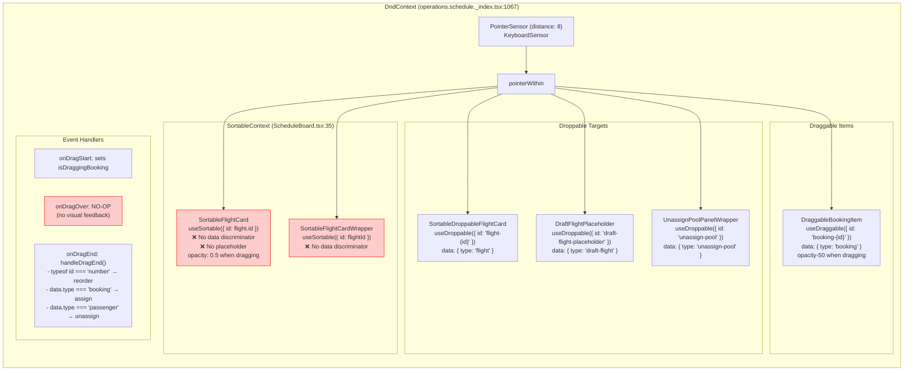
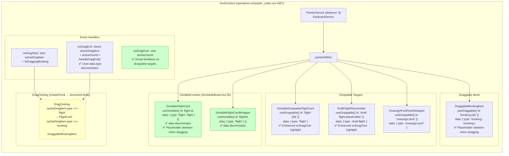
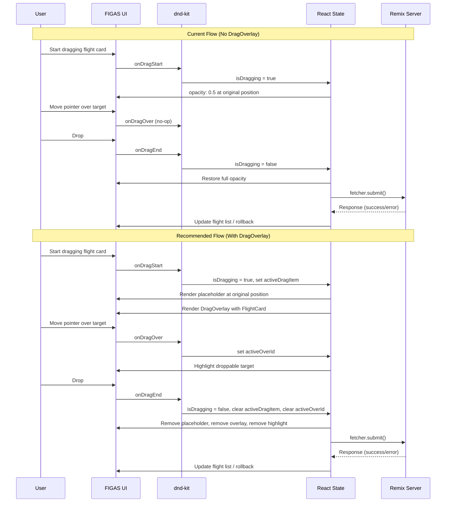

# Kanban Board Pattern Recommendations for FIGAS Scheduling Tool

## 1. Executive Summary

This document analyzes the dnd-kit implementation patterns found in the `.sample-kanban-board/` (a standalone Vite+React+Tailwind kanban board) and evaluates their applicability to the FIGAS flight scheduling tool. The kanban board demonstrates mature drag-and-drop patterns including `DragOverlay` with `createPortal`, placeholder skeletons during drag, `data` discriminators on all sortables, and real-time `onDragOver` state mutation.

The FIGAS scheduling tool currently lacks several of these patterns, resulting in a less polished drag experience. **The top three recommendations** are:

1. **Implement `DragOverlay` with `createPortal`** — the highest-impact, lowest-risk change that dramatically improves perceived drag quality
2. **Add placeholder skeletons during drag** — eliminates the jarring "empty space" at the original position
3. **Add `data` discriminators to all sortables** — replaces fragile `typeof active.id === "number"` checks with explicit type discrimination

All recommendations are ordered by priority, with risk assessments and implementation guidance for each.

---

## 2. Pattern Comparison Table

| Dimension | Kanban Board (`.sample-kanban-board/`) | FIGAS Scheduling Tool | Gap |
|---|---|---|---|
| **DndContext** | Single, wraps entire board | Single, wraps manual build view | ✅ Aligned |
| **Sensors** | `PointerSensor` with `distance: 3` | `PointerSensor` with `distance: 8` + `KeyboardSensor` | ⚠️ Different activation distance (3 vs 8) |
| **Collision Detection** | Default (`rectIntersection`) | `pointerWithin` | ✅ Intentional — `pointerWithin` is correct for sparse layout |
| **DragOverlay** | `createPortal(DragOverlay, document.body)` — renders full component | ❌ None — uses `opacity: 0.5` at original position | 🔴 **Missing** |
| **Placeholder Skeleton** | Empty `div` with `border-2 border-rose-500` when `isDragging` | ❌ None — original position shows nothing meaningful | 🔴 **Missing** |
| **data Discriminator** | `data: { type: "Column", column }` and `data: { type: "Task", task }` | Partial — `useDroppable` has `data: { type: "flight" }`, but `useSortable` has no `data` prop | 🟡 **Partial** |
| **disabled Prop** | `disabled: editMode` on `useSortable` during inline editing | ❌ Not used — no inline editing exists | 🟢 Future |
| **onDragOver** | Real-time state mutation — tasks change `columnId` as pointer moves | No-op — all logic in `onDragEnd` | 🟡 **No visual feedback** |
| **SortableContext** | Nested: Columns → Tasks | Flat: Single list of flights | ✅ Intentional — FIGAS has flat flight list |
| **Dual-role components** | None — columns use `useSortable`, tasks use `useSortable` | Flight cards use both `useSortable` (reorder) AND `useDroppable` (receive bookings) | ✅ Intentional — FIGAS requirement |
| **State persistence** | Client-side `useState` | Server-persisted via Remix `useFetcher` form submissions | ✅ Intentional — architectural difference |
| **Controls visibility** | Hover-reveal (delete button on hover) | Always visible | 🟢 UX preference |
| **Inline editing** | Click to edit, Enter/Shift+Enter to confirm | Server action forms (modal-based) | ✅ Intentional |

---

## 3. Recommended Enhancements (Priority-Ordered)

### 🔴 High Priority

---

#### R-01: Implement DragOverlay with createPortal

| Field | Detail |
|---|---|
| **Priority** | 🔴 High |
| **Pattern Source** | [`KanbanBoard.tsx:180`](.sample-kanban-board/src/components/KanbanBoard.tsx:180) |
| **Current FIGAS Behavior** | No `DragOverlay` exists. When dragging a flight card, the original position shows `opacity: 0.5` and the dragged element follows the cursor as a ghost. When dragging a booking item, `isDragging` sets `opacity: 50` on the original element. |
| **Proposed Change** | Add `DragOverlay` from `@dnd-kit/core` inside the `DndContext` in [`operations.schedule._index.tsx`](app/routes/operations.schedule._index.tsx:1067), portaled to `document.body` via `createPortal`. Track the active drag item in a new state variable (`activeDragItem`) set during `onDragStart` and cleared during `onDragEnd`. Render the full `FlightCard` or `DraggableBookingItem` inside the overlay based on `activeDragData.type`. |
| **Implementation Guidance** | |
| | 1. Add imports: `DragOverlay` from `@dnd-kit/core`, `createPortal` from `react-dom` |
| | 2. Add state: `const [activeDragItem, setActiveDragItem] = useState<{ type: "flight" \| "booking"; data: any } | null>(null)` |
| | 3. In `onDragStart`, set `activeDragItem` based on `event.active.data.current.type` |
| | 4. In `onDragEnd`, clear `activeDragItem` to `null` |
| | 5. Inside `DndContext`, after the board content, add: `{createPortal(<DragOverlay>{activeDragItem?.type === "flight" ? <FlightCard ... /> : activeDragItem?.type === "booking" ? <DraggableBookingItem ... /> : null}</DragOverlay>, document.body)}` |
| | 6. Remove `opacity: 0.5` from [`ScheduleBoard.tsx:83`](app/components/schedule/ScheduleBoard.tsx:83) and `opacity-50` from [`DraggableBookingItem.tsx:28`](app/components/schedule/DraggableBookingItem.tsx:28) |
| **Files Affected** | [`app/routes/operations.schedule._index.tsx`](app/routes/operations.schedule._index.tsx:1067) (DndContext section), [`app/components/schedule/ScheduleBoard.tsx`](app/components/schedule/ScheduleBoard.tsx:83) (remove opacity), [`app/components/schedule/DraggableBookingItem.tsx`](app/components/schedule/DraggableBookingItem.tsx:28) (remove opacity) |
| **Risk Assessment** | **Low.** DragOverlay is a visual-only addition. It does not change any state management, event handler logic, or server interaction. The existing `onDragEnd` handler remains unchanged. The only risk is if the overlay renders at the wrong z-index or position, which is easily fixable with CSS. |
| **Test Impact** | The E2E drag simulator at [`tests/e2e/helpers/drag-simulator.ts`](tests/e2e/helpers/drag-simulator.ts) uses pointer events on the original elements, which should still work since the original elements remain in the DOM (they just render differently). However, tests that assert on `opacity` styles may need updating. |
| **Estimated Effort** | Small (~2-3 hours) |

---

#### R-02: Add Placeholder Skeleton During Drag

| Field | Detail |
|---|---|
| **Priority** | 🔴 High |
| **Pattern Source** | [`ColumnContainer.tsx:37`](.sample-kanban-board/src/components/ColumnContainer.tsx:37), [`TaskCard.tsx:31`](.sample-kanban-board/src/components/TaskCard.tsx:31) |
| **Current FIGAS Behavior** | When dragging a flight card, the original position shows the card at `opacity: 0.5` (semi-transparent). When dragging a booking item, the original position shows `opacity: 50`. Neither shows a dedicated placeholder skeleton. |
| **Proposed Change** | When `isDragging` is `true` on a sortable/draggable, render an empty skeleton `div` with the same dimensions and a dashed border (e.g., `border-2 border-dashed border-blue-400 bg-blue-50/30`) instead of the full card content. This provides a clear visual cue of where the item will land when dropped. |
| **Implementation Guidance** | |
| | 1. In [`ScheduleBoard.tsx`](app/components/schedule/ScheduleBoard.tsx:77), in the `SortableFlightCard` component, add an early return when `isDragging` is true: render a placeholder `div` with `ref={setNodeRef}`, `style={style}`, and classes like `border-2 border-dashed border-blue-400 rounded-lg bg-blue-50/30 min-h-[100px]` |
| | 2. In [`DraggableBookingItem.tsx`](app/components/schedule/DraggableBookingItem.tsx:12), add an early return when `isDragging` is true: render a placeholder `div` with `ref={setNodeRef}` and similar dashed border styling |
| | 3. The placeholder should maintain the same dimensions as the original card to prevent layout shift |
| **Files Affected** | [`app/components/schedule/ScheduleBoard.tsx`](app/components/schedule/ScheduleBoard.tsx:67) (SortableFlightCard), [`app/components/schedule/DraggableBookingItem.tsx`](app/components/schedule/DraggableBookingItem.tsx:12) |
| **Risk Assessment** | **Low.** Purely visual change. The placeholder is rendered in place of the original content when `isDragging` is true. No state or event handler changes. The `setNodeRef` must still be attached to the placeholder so dnd-kit can track the original position. |
| **Test Impact** | E2E tests that select elements by their content text may fail if the placeholder replaces the content during drag. Tests using `drag-simulator.ts` should still work since they use positional coordinates, not content selectors. |
| **Estimated Effort** | Small (~1-2 hours) |

---

### 🟡 Medium Priority

---

#### R-03: Add `data` Discriminator to All Sortables

| Field | Detail |
|---|---|
| **Priority** | 🟡 Medium |
| **Pattern Source** | [`ColumnContainer.tsx:29`](.sample-kanban-board/src/components/ColumnContainer.tsx:29), [`TaskCard.tsx:17`](.sample-kanban-board/src/components/TaskCard.tsx:17) |
| **Current FIGAS Behavior** | In [`operations.schedule._index.tsx:803`](app/routes/operations.schedule._index.tsx:803), the `handleDragEnd` function uses `typeof active.id === "number"` to distinguish flight reordering from booking assignment. This is fragile because it assumes all flight IDs are numbers and all booking IDs are strings. The `useSortable` calls in [`ScheduleBoard.tsx:78`](app/components/schedule/ScheduleBoard.tsx:78) and [`ScheduleBoard.tsx:111`](app/components/schedule/ScheduleBoard.tsx:111) do not pass a `data` prop. |
| **Proposed Change** | Add `data: { type: "flight", flight }` to the `useSortable` options in both `SortableFlightCard` and `SortableFlightCardWrapper` in [`ScheduleBoard.tsx`](app/components/schedule/ScheduleBoard.tsx). Add `data: { type: "booking", booking }` to the `useDraggable` options in [`DraggableBookingItem.tsx`](app/components/schedule/DraggableBookingItem.tsx) (already partially done — `data: { type: "booking", booking }` exists). Then update `handleDragEnd` in [`operations.schedule._index.tsx:785`](app/routes/operations.schedule._index.tsx:785) to use `active.data.current?.type` instead of `typeof active.id === "number"`. |
| **Implementation Guidance** | |
| | 1. In [`ScheduleBoard.tsx:78`](app/components/schedule/ScheduleBoard.tsx:78), change `useSortable({ id: flight.id })` to `useSortable({ id: flight.id, data: { type: "flight", flight } })` |
| | 2. In [`ScheduleBoard.tsx:111`](app/components/schedule/ScheduleBoard.tsx:111), change `useSortable({ id: flightId })` to `useSortable({ id: flightId, data: { type: "flight" } })` |
| | 3. In [`operations.schedule._index.tsx:803`](app/routes/operations.schedule._index.tsx:803), change `typeof active.id === "number"` to `active.data.current?.type === "flight"` |
| | 4. The `overFlightId` logic at line 796-800 can be simplified since `overData?.type === "flight"` will now work for both droppable and sortable targets |
| **Files Affected** | [`app/components/schedule/ScheduleBoard.tsx`](app/components/schedule/ScheduleBoard.tsx:78), [`app/routes/operations.schedule._index.tsx`](app/routes/operations.schedule._index.tsx:785-810) |
| **Risk Assessment** | **Low.** The `data` payload is additive and does not break existing logic. The `typeof active.id === "number"` check can be kept as a fallback during migration. The change makes the code more robust and self-documenting. |
| **Test Impact** | None. The change is purely internal — no DOM structure or behavior changes. |
| **Estimated Effort** | Small (~1 hour) |

---

#### R-04: Implement Real-time onDragOver for Cross-Container Feedback

| Field | Detail |
|---|---|
| **Priority** | 🟡 Medium |
| **Pattern Source** | [`KanbanBoard.tsx:106`](.sample-kanban-board/src/components/KanbanBoard.tsx:106) |
| **Current FIGAS Behavior** | The `onDragOver` handler at [`operations.schedule._index.tsx:1074`](app/routes/operations.schedule._index.tsx:1074) is a no-op with a comment: `// No-op needed to ensure isOver state updates continuously on droppables`. All assignment logic happens exclusively in `onDragEnd`. |
| **Proposed Change** | Use `onDragOver` to provide visual feedback (e.g., highlight the droppable zone the pointer is currently over) without persisting state. The kanban board pattern mutates `columnId` in real-time, but FIGAS should NOT do this — state mutation should remain in `onDragEnd` via server action. Instead, use `onDragOver` to update a local `activeOverId` state that drives CSS highlight classes on droppable targets. |
| **Implementation Guidance** | |
| | 1. Add state: `const [activeOverId, setActiveOverId] = useState<string | null>(null)` |
| | 2. In `onDragOver`, set `setActiveOverId(over?.id?.toString() ?? null)` |
| | 3. In `onDragEnd`, clear `setActiveOverId(null)` |
| | 4. Pass `activeOverId` to `SortableDroppableFlightCard` and `DraftFlightPlaceholder` so they can show enhanced visual feedback (e.g., a pulsing ring or glow effect) when the pointer is over them |
| | 5. The existing `isOver` state from `useDroppable` already provides basic feedback — this enhancement adds a more prominent visual cue |
| **Files Affected** | [`app/routes/operations.schedule._index.tsx`](app/routes/operations.schedule._index.tsx:1074) (onDragOver), [`app/components/schedule/SortableDroppableFlightCard.tsx`](app/components/schedule/SortableDroppableFlightCard.tsx) (accept activeOverId prop), [`app/components/schedule/DraftFlightPlaceholder.tsx`](app/components/schedule/DraftFlightPlaceholder.tsx) (accept activeOverId prop) |
| **Risk Assessment** | **Medium.** The primary risk is performance — `onDragOver` fires frequently. The state update must be lightweight and not trigger expensive re-renders. Use `useCallback` and consider using a ref instead of state if performance issues arise. The second risk is visual confusion if the highlight conflicts with the existing `isOver` styling from `useDroppable`. |
| **Test Impact** | E2E tests that assert on visual styles during drag may need updating if the highlight classes change. The drag simulator itself should not be affected. |
| **Estimated Effort** | Medium (~3-4 hours) |

---

### 🟢 Low Priority

---

#### R-05: Add `disabled` Prop to useSortable During Edit Modes

| Field | Detail |
|---|---|
| **Priority** | 🟢 Low |
| **Pattern Source** | [`ColumnContainer.tsx:30`](.sample-kanban-board/src/components/ColumnContainer.tsx:30) |
| **Current FIGAS Behavior** | FIGAS has no inline editing on flight cards. All edits (pilot assignment, aircraft assignment, etc.) are done via server action forms and dropdown controls that are always visible on the card. |
| **Proposed Change** | If inline editing is ever added to flight cards (e.g., editing flight number, departure time), use `disabled: editMode` in the `useSortable` options to prevent drag interference while the user is typing. This pattern from the kanban board ensures that text inputs inside sortable elements don't accidentally trigger drag operations. |
| **Implementation Guidance** | |
| | 1. When adding inline editing to a sortable component, add a local `editMode` state |
| | 2. Pass `disabled: editMode` to the `useSortable` options |
| | 3. This prevents `PointerSensor` from activating while the user is interacting with text inputs |
| **Files Affected** | Future components (no current files need changes) |
| **Risk Assessment** | **None.** This is future-proofing advice. The pattern is well-established and low-risk. |
| **Test Impact** | None until inline editing is implemented. |
| **Estimated Effort** | Trivial when implemented |

---

#### R-06: Consider Hover-Reveal Action Buttons

| Field | Detail |
|---|---|
| **Priority** | 🟢 Low |
| **Pattern Source** | [`TaskCard.tsx:74`](.sample-kanban-board/src/components/TaskCard.tsx:74) |
| **Current FIGAS Behavior** | Flight cards in [`FlightCard.tsx`](app/components/schedule/FlightCard.tsx) show all controls (pilot assignment, aircraft assignment, etc.) always visible. This provides immediate access but can create visual clutter, especially on cards with many controls. |
| **Proposed Change** | For secondary actions (delete flight, cancel flight), consider hover-reveal to reduce visual clutter. Keep primary actions (assign pilot, assign aircraft, approve) always visible since they are frequently used. The kanban board pattern uses `mouseIsOver` state to conditionally render the delete button. |
| **Implementation Guidance** | |
| | 1. Add `mouseIsOver` state to `FlightCard.tsx` |
| | 2. Wrap secondary action buttons in a conditional render: `{mouseIsOver && <button>...</button>}` |
| | 3. Add `onMouseEnter`/`onMouseLeave` handlers to the card container |
| | 4. Ensure the delete/cancel buttons have sufficient hit area (minimum 44×44px for touch targets) |
| **Files Affected** | [`app/components/schedule/FlightCard.tsx`](app/components/schedule/FlightCard.tsx) |
| **Risk Assessment** | **Low.** This is a UX preference change. The main risk is accessibility — hover-reveal controls are not discoverable on touch devices. Ensure there is an alternative way to access these actions (e.g., a "more" menu or keyboard shortcut). |
| **Test Impact** | Any E2E tests that click on secondary action buttons will need to hover over the card first, or the test will need to use a different selector (e.g., a "more" menu button). |
| **Estimated Effort** | Small (~2 hours) |

---

## 4. Implementation Order

The recommended implementation sequence is designed to minimize risk and maximize visual impact early:

```
Phase 1: Visual Foundation (Week 1)
├── R-01: DragOverlay with createPortal ────────── No state changes, pure visual
├── R-02: Placeholder skeleton during drag ─────── No state changes, pure visual
└── Result: Drag experience immediately feels polished

Phase 2: Data Architecture (Week 2)
├── R-03: data discriminator on all sortables ──── Prerequisite for cleaner handlers
└── Result: Event handler logic is more robust and self-documenting

Phase 3: Interaction Feedback (Week 3)
├── R-04: Real-time onDragOver feedback ────────── Requires R-03 for clean implementation
└── Result: Users see which drop target is active during drag

Phase 4: UX Polish (Anytime)
├── R-06: Hover-reveal action buttons ──────────── Independent, can be done anytime
└── Result: Reduced visual clutter on flight cards

Phase 5: Future-Proofing (When Needed)
└── R-05: disabled prop for edit modes ─────────── Only when inline editing is added
```

### Dependency Graph

```
R-01 ──┐
        ├── No dependencies — can be done first
R-02 ──┘

R-03 ──► R-04 (R-04 benefits from R-03's data discriminators)

R-05 ── (requires inline editing feature to exist)

R-06 ── (independent)
```

---

## 5. Test Impact

| Recommendation | Test Impact | Mitigation |
|---|---|---|
| **R-01** (DragOverlay) | Low. The E2E drag simulator at [`tests/e2e/helpers/drag-simulator.ts`](tests/e2e/helpers/drag-simulator.ts) uses pointer events on original elements, which remain in the DOM. However, tests that assert on `opacity` styles (e.g., checking `opacity: 0.5`) will fail since the original element is no longer semi-transparent. | Update any assertions that check for `opacity: 0.5` or `opacity-50` classes. The drag simulator itself does not need changes. |
| **R-02** (Placeholder) | Low. Tests that select elements by content text may fail if the placeholder replaces the content during drag. The drag simulator uses positional coordinates, so it is unaffected. | Ensure E2E tests that interact with cards during drag use coordinate-based selectors or wait for drag to complete before asserting on content. |
| **R-03** (data discriminator) | None. The change is purely internal — no DOM structure, CSS classes, or behavior changes. | No test changes needed. |
| **R-04** (onDragOver feedback) | Low-Medium. If the visual feedback adds new CSS classes or data attributes to droppable targets, E2E tests may need to account for these. | Update any tests that assert on the visual state of droppable targets during drag. |
| **R-05** (disabled prop) | None until inline editing is implemented. | N/A |
| **R-06** (hover-reveal) | Medium. E2E tests that click on secondary action buttons (delete, cancel) will need to hover over the card first. | Update affected tests to hover over the card before clicking the button. Alternatively, keep a "more" menu or keyboard shortcut as an alternative access method. |

### Drag Simulator Compatibility

The existing [`drag-simulator.ts`](tests/e2e/helpers/drag-simulator.ts) uses `page.mouse.move`, `page.mouse.down`, and `page.mouse.up` to simulate drag operations. This approach is compatible with all recommendations because:

- `DragOverlay` (R-01) renders a portal overlay that follows the cursor — the pointer events on the original elements still fire correctly
- Placeholder skeletons (R-02) replace content but keep the same DOM node (via `setNodeRef`) — pointer events are unaffected
- `data` discriminators (R-03) are internal to dnd-kit's data model — no DOM changes
- Hover-reveal (R-06) requires the mouse to be over the card, which the simulator already does by moving to the element's center

---

## 6. Patterns NOT to Borrow

### Nested SortableContext

The kanban board uses nested `SortableContext` instances: an outer context for columns and an inner context for tasks within each column. FIGAS has a flat flight list, not a column-with-tasks hierarchy. The current flat `SortableContext` in [`ScheduleBoard.tsx:35`](app/components/schedule/ScheduleBoard.tsx:35) is correct for FIGAS's use case. Adding nesting would introduce unnecessary complexity and potential bugs with collision detection across contexts.

### Client-side CRUD

The kanban board manages all state client-side with `useState` — columns and tasks are created, updated, and deleted in memory. FIGAS persists all state server-side via Remix `useFetcher` form submissions. This is an architectural constraint, not a gap. The kanban board's pattern of optimistic updates followed by reconciliation is already partially implemented in FIGAS (see `pendingOpsRef` at [`operations.schedule._index.tsx:592`](app/routes/operations.schedule._index.tsx:592)), but the actual state mutation must always go through the server.

### Inline Editing

The kanban board supports inline editing of column titles and task content via click-to-edit with `contentEditable`-like behavior. FIGAS uses server action forms for all edits (pilot assignment, aircraft assignment, etc.). Inline editing would require significant architectural changes to support optimistic updates and conflict resolution. The current modal-based approach is appropriate for FIGAS's server-persisted model.

### Default Collision Detection (`rectIntersection`)

The kanban board uses the default `rectIntersection` collision detection strategy, which works well for its grid-like layout of columns and tasks. FIGAS uses `pointerWithin` (set at [`operations.schedule._index.tsx:1069`](app/routes/operations.schedule._index.tsx:1069)), which is correct for its sparse, vertical list layout. `pointerWithin` detects collisions based on the pointer position rather than rectangle overlap, which is more intuitive when dragging items between the unassigned pool (sidebar) and the flight list (main content area).

### Real-time `columnId` Mutation

The kanban board mutates `task.columnId` in real-time during `onDragOver`, causing tasks to visually move between columns as the pointer crosses column boundaries. FIGAS bookings do not have a `columnId` — they are assigned to flights via `flight_leg_id`. Real-time mutation of `flight_leg_id` would be architecturally incorrect because:
1. Assignments must be validated server-side (e.g., seat capacity, weight limits)
2. The server owns the authoritative state
3. Optimistic updates are already handled via `pendingOpsRef` with rollback on error

The recommended approach (R-04) uses `onDragOver` for visual feedback only, not state mutation.

---

## 7. Architecture Diagram (Mermaid)

### Current FIGAS dnd-kit Architecture



### Recommended FIGAS dnd-kit Architecture



### Data Flow Comparison



---

## Appendix: Key File Reference

| File | Purpose | Lines of Interest |
|---|---|---|
| [`.sample-kanban-board/src/components/KanbanBoard.tsx`](.sample-kanban-board/src/components/KanbanBoard.tsx) | Main kanban board with DndContext, DragOverlay, event handlers | L18-20 (sensors), L73-83 (onDragStart), L85-103 (onDragEnd), L106-137 (onDragOver), L149 (DndContext), L180-196 (DragOverlay portal) |
| [`.sample-kanban-board/src/components/ColumnContainer.tsx`](.sample-kanban-board/src/components/ColumnContainer.tsx) | Sortable column with placeholder skeleton | L27-31 (useSortable with data + disabled), L37-44 (placeholder skeleton) |
| [`.sample-kanban-board/src/components/TaskCard.tsx`](.sample-kanban-board/src/components/TaskCard.tsx) | Sortable task card with hover-reveal delete | L17-21 (useSortable with data + disabled), L31-36 (placeholder skeleton), L74-80 (hover-reveal delete) |
| [`app/routes/operations.schedule._index.tsx`](app/routes/operations.schedule._index.tsx) | Main schedule builder route — DndContext, event handlers, state management | L586-589 (sensors), L785-843 (handleDragEnd), L1067-1139 (DndContext + board layout) |
| [`app/components/schedule/ScheduleBoard.tsx`](app/components/schedule/ScheduleBoard.tsx) | Sortable flight card wrappers with useSortable | L67-91 (SortableFlightCard), L97-124 (SortableFlightCardWrapper) |
| [`app/components/schedule/SortableDroppableFlightCard.tsx`](app/components/schedule/SortableDroppableFlightCard.tsx) | Dual-role flight card (sortable + droppable) | L25-28 (useDroppable with data), L87-97 (render with isOver highlight) |
| [`app/components/schedule/DraggableBookingItem.tsx`](app/components/schedule/DraggableBookingItem.tsx) | Draggable booking item | L13-16 (useDraggable with data), L28 (opacity-50 when dragging) |
| [`app/components/schedule/DraftFlightPlaceholder.tsx`](app/components/schedule/DraftFlightPlaceholder.tsx) | Draft flight drop zone | L8-11 (useDroppable with data), L16-22 (isOver highlight styling) |
| [`app/components/schedule/FlightCard.tsx`](app/components/schedule/FlightCard.tsx) | Flight card display component | L1-100 (types and interface), controls always visible |
| [`app/components/schedule/UnassignPoolPanel.tsx`](app/components/schedule/UnassignPoolPanel.tsx) | Unassigned bookings panel | L8-36 (panel with DraggableBookingItem list) |
| [`tests/e2e/helpers/drag-simulator.ts`](tests/e2e/helpers/drag-simulator.ts) | E2E drag simulation helper | L11-54 (simulateDragDrop), L63-71 (dragBookingToFlight), L79-83 (dragBookingToDraftFlight) |