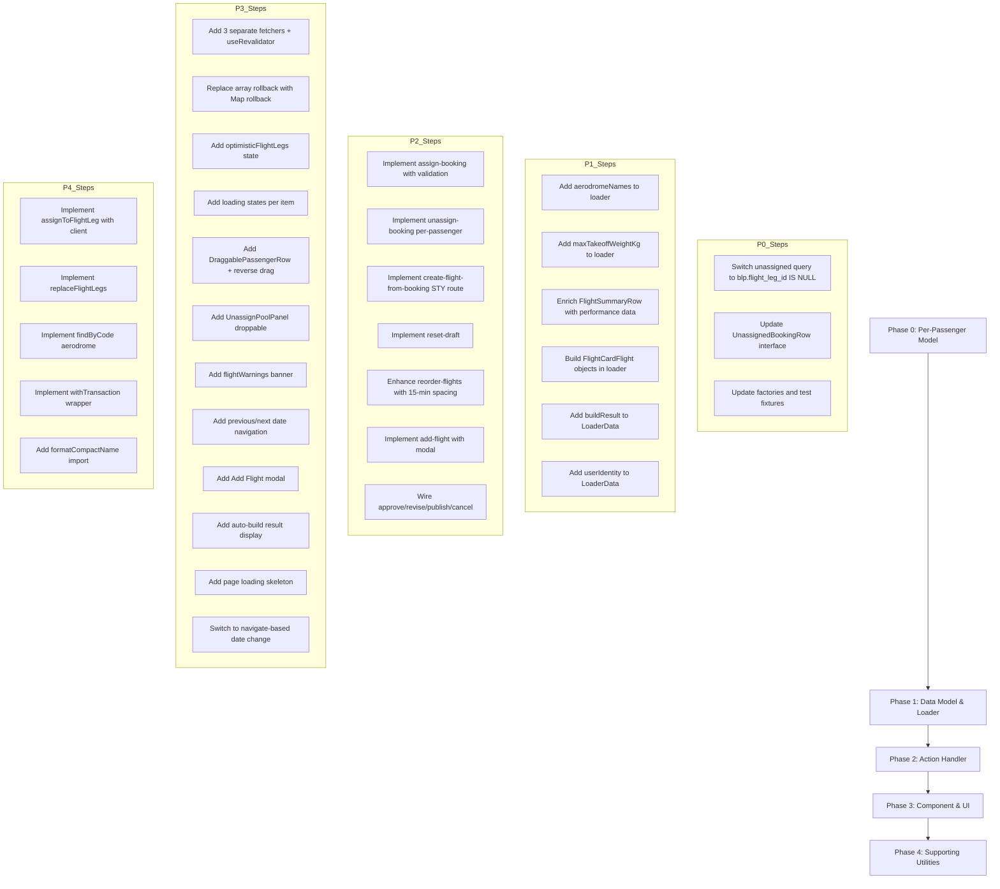

# Schedule Builder — Backup Gap Analysis

> **Status:** Active Planning Document
> **Source Backup:** `C:\Users\Leeqoqo\Documents\Code\FIGAS VI\FIGAS-remix-II-backup-2026-05-25`
> **Current File:** [`app/routes/operations.schedule._index.tsx`](app/routes/operations.schedule._index.tsx) (871 lines)
> **Backup File:** `operations.schedule._index.tsx` (2532 lines)
> **Last Updated:** 2026-06-02

---

## Table of Contents

1. [Executive Summary](#1-executive-summary)
2. [Phase 1 — Data Model & Loader (Critical)](#2-phase-1--data-model--loader-critical)
3. [Phase 2 — Action Handler (Critical)](#3-phase-2--action-handler-critical)
4. [Phase 3 — Component & UI (High Priority)](#4-phase-3--component--ui-high-priority)
5. [Phase 4 — Supporting Utilities (Medium Priority)](#5-phase-4--supporting-utilities-medium-priority)
6. [Architectural Differences Summary](#6-architectural-differences-summary)
7. [Recommended Implementation Order](#7-recommended-implementation-order)

---

## 1. Executive Summary

The backup at `FIGAS-remix-II-backup-2026-05-25` contains a significantly more feature-complete schedule builder (2532 lines) compared to the current implementation (871 lines). The backup was apparently a working version that was later replaced with a simplified rewrite. This document itemizes every feature, code pattern, and architectural decision from the backup that is missing from the current implementation.

**Key Architectural Differences:**

| Aspect | Backup | Current |
|--------|--------|---------|
| Assignment unit | Per-passenger (`booking_leg_passengers`) | Per-booking-leg (`booking_legs`) |
| Auth function | `requireAuth()` (returns user ID) | `requirePermission()` (returns user object) |
| Fetchers | 3 separate fetchers (`assignFetcher`, `unassignFetcher`, `reorderFetcher`) | Single `fetcher` |
| Rollback mechanism | `Map<string, {type, rollback}>` with per-operation tracking | Array-based `pendingOps` with single rollback |
| Data refresh | `useRevalidator` after mutations | Navigation-based refresh |
| Flight card data | Rich `FlightCardFlight` objects with `flight_legs`, `stop_manifests`, pilot/aircraft data | Simple `FlightSummaryRow` with separate arrays |
| Validation | Server-side `validateFlight()` with weight/balance, range, fuel, MTOW/MLW per stop | Client-side only |
| Transactions | `withTransaction()` for atomic multi-step operations | Inline `$transaction` |
| Unassigned query | `blp.flight_leg_id IS NULL` (per-passenger) | `bl.flight_id IS NULL` (per-booking-leg) |

---

## 2. Phase 1 — Data Model & Loader (Critical)

### 1.1 Switch to Per-Passenger Unassigned Query

**Backup:** Lines 396-423 — Queries `booking_leg_passengers` with `blp.flight_leg_id IS NULL` to get unassigned passengers individually.

**Current:** Lines 147-162 — Queries `booking_legs` with `bl.flight_id IS NULL` to get unassigned booking legs.

**Impact:** The current approach assigns entire booking legs (all passengers on a leg) at once. The backup assigns individual passengers, which is more granular and correct for the FIGAS model where passengers on the same booking leg may have different origins/destinations.

**Code Reference:**
- Backup: [`booking_leg_passengers` query with `blp.flight_leg_id IS NULL`](C:\Users\Leeqoqo\Documents\Code\FIGAS VI\FIGAS-remix-II-backup-2026-05-25\app\routes\operations.schedule._index.tsx:396-423)
- Current: [`booking_legs` query with `bl.flight_id IS NULL`](app/routes/operations.schedule._index.tsx:147-162)

### 1.2 Add `aerodromeNames` to Loader

**Backup:** Lines 163-169, 427-430 — Fetches all aerodrome codes and names into a `Map<string, string>` for display purposes.

**Current:** Missing entirely.

**Impact:** Aerodrome names are not available in the UI, so stops display as codes only (e.g., "STY" instead of "Stanley").

**Code Reference:**
- Backup: [`aerodromeNames` query and Map construction](C:\Users\Leeqoqo\Documents\Code\FIGAS VI\FIGAS-remix-II-backup-2026-05-25\app\routes\operations.schedule._index.tsx:163-169)

### 1.3 Add `maxTakeoffWeightKg` to Loader

**Backup:** Lines 160, 386-392 — Fetches `max_takeoff_weight_kg` from the `aircraft` table for weight validation.

**Current:** Missing entirely.

**Impact:** Weight validation cannot compute MTOW utilization without this value.

**Code Reference:**
- Backup: [`maxTakeoffWeightKg` in LoaderData](C:\Users\Leeqoqo\Documents\Code\FIGAS VI\FIGAS-remix-II-backup-2026-05-25\app\routes\operations.schedule._index.tsx:160)
- Backup: [Aircraft query for max_takeoff_weight_kg](C:\Users\Leeqoqo\Documents\Code\FIGAS VI\FIGAS-remix-II-backup-2026-05-25\app\routes\operations.schedule._index.tsx:386-392)

### 1.4 Enrich `FlightSummaryRow` with Aircraft Performance Data

**Backup:** Lines 59-82, 348-382 — `FlightSummaryRow` includes `available_seats`, `total_passenger_weight_kg`, `total_baggage_weight_kg`, `total_freight_weight_kg`, `operational_notes`, `check_in_time`.

**Current:** Lines 79-105 — `FlightSummaryRow` is minimal with only basic flight fields.

**Impact:** The UI cannot display weight summaries, check-in times, or operational notes without this data being loaded server-side.

**Code Reference:**
- Backup: [`FlightSummaryRow` interface](C:\Users\Leeqoqo\Documents\Code\FIGAS VI\FIGAS-remix-II-backup-2026-05-25\app\routes\operations.schedule._index.tsx:59-82)
- Current: [`FlightSummaryRow` interface](app/routes/operations.schedule._index.tsx:79-105)

### 1.5 Build `FlightCardFlight` Objects with `flight_legs` and `stop_manifests` in Loader

**Backup:** Lines 261-383 — The loader builds rich `FlightCardFlight` objects by:
- Grouping legs by `flight_id`
- Grouping passengers by `flight_id`
- Building stop manifests per aerodrome with departing/arriving passengers
- Computing check-in time
- Fetching aircraft data for validation

**Current:** Lines 62-188 — The loader returns flat arrays (`flights`, `flightLegs`, `passengerManifests`) and the component builds `FlightCardFlight` objects client-side.

**Impact:** The backup's approach is more efficient (computation happens once on the server) and produces richer data structures. The current approach requires client-side computation and re-computation on every render.

**Code Reference:**
- Backup: [`FlightCardFlight` construction in loader](C:\Users\Leeqoqo\Documents\Code\FIGAS VI\FIGAS-remix-II-backup-2026-05-25\app\routes\operations.schedule._index.tsx:261-383)

### 1.6 Add `buildResult` to `LoaderData`

**Backup:** Line 142 — `buildResult` is included in `LoaderData` to display auto-build results (e.g., "Built 5 flights for 12 passengers").

**Current:** Missing entirely.

**Impact:** After auto-build, the user sees no confirmation of what was built.

**Code Reference:**
- Backup: [`buildResult` in LoaderData](C:\Users\Leeqoqo\Documents\Code\FIGAS VI\FIGAS-remix-II-backup-2026-05-25\app\routes\operations.schedule._index.tsx:142)

### 1.7 Add `userIdentity` to `LoaderData`

**Backup:** Line 143 — `userIdentity` is included for the `PageLayout` component's header display.

**Current:** Missing — the current implementation doesn't pass user identity to the layout.

**Impact:** The page header may not display the current user's name or role.

**Code Reference:**
- Backup: [`userIdentity` in LoaderData](C:\Users\Leeqoqo\Documents\Code\FIGAS VI\FIGAS-remix-II-backup-2026-05-25\app\routes\operations.schedule._index.tsx:143)

---

## 3. Phase 2 — Action Handler (Critical)

### 2.1 Switch Action to `requireAuth`

**Backup:** Line 459 — Uses `requireAuth(request)` which returns a user ID (number).

**Current:** Line 214 — Uses `requirePermission(request, ...)` which returns a user object.

**Impact:** The backup's approach is simpler for actions that only need the user ID for audit fields. The current approach requires extracting the user ID from the returned object.

**Code Reference:**
- Backup: [`requireAuth` in action](C:\Users\Leeqoqo\Documents\Code\FIGAS VI\FIGAS-remix-II-backup-2026-05-25\app\routes\operations.schedule._index.tsx:459)
- Current: [`requirePermission` in action](app/routes/operations.schedule._index.tsx:214)

### 2.2 Implement `assign-booking` with Server-Side Validation (~365 lines)

**Backup:** Lines 571-936 — The `assign-booking` handler includes:
1. **`validateFlight()`** — Server-side validation for weight/balance, seat count, range, fuel, MTOW/MLW per stop
2. **`insertPassengerRoute()`** — Dynamic route rebuilding when a passenger's origin→destination doesn't match existing flight legs
3. **Re-mapping existing passengers** — When a new leg is inserted, existing passengers are re-mapped to the updated leg structure
4. **Re-running validation** — After route insertion, validation is re-run with updated legs
5. **Updating `arrival_time`** — Recalculated after route changes
6. **`withTransaction`** — All operations wrapped in atomic transaction

**Current:** Lines 299-308 — Minimal handler that delegates to `handleAssignBooking()` in `schedule-handlers.server.ts`.

**Impact:** The current implementation lacks server-side validation, dynamic route insertion, and proper passenger re-mapping. Assigning a passenger whose origin/destination doesn't match existing legs may produce incorrect results.

**Code Reference:**
- Backup: [`assign-booking` handler](C:\Users\Leeqoqo\Documents\Code\FIGAS VI\FIGAS-remix-II-backup-2026-05-25\app\routes\operations.schedule._index.tsx:571-936)
- Backup: [`validateFlight()` with ValidationLeg](C:\Users\Leeqoqo\Documents\Code\FIGAS VI\FIGAS-remix-II-backup-2026-05-25\app\routes\operations.schedule._index.tsx:621-626)
- Backup: [Existing passenger re-mapping](C:\Users\Leeqoqo\Documents\Code\FIGAS VI\FIGAS-remix-II-backup-2026-05-25\app\routes\operations.schedule._index.tsx:668-675)
- Backup: [`withTransaction` wrapper](C:\Users\Leeqoqo\Documents\Code\FIGAS VI\FIGAS-remix-II-backup-2026-05-25\app\routes\operations.schedule._index.tsx:774-783, 793-929)
- Backup: [Updated validation legs after route insertion](C:\Users\Leeqoqo\Documents\Code\FIGAS VI\FIGAS-remix-II-backup-2026-05-25\app\routes\operations.schedule._index.tsx:844-849)

### 2.3 Implement `unassign-booking` with Per-Passenger Unassignment

**Backup:** Lines 1036-1100 — Uses `booking_leg_passengers` for per-passenger unassignment:
- Deletes the specific `booking_leg_passenger` record
- Checks remaining passengers on the flight
- If no passengers remain, deletes the flight (empty flight cleanup)
- All wrapped in `withTransaction`

**Current:** Lines 321-329 — Delegates to `handleUnassignBooking()` which works at the `booking_legs` level.

**Impact:** The current implementation unassigns entire booking legs, not individual passengers. This is less granular and may unassign passengers who should remain on the flight.

**Code Reference:**
- Backup: [`unassign-booking` handler](C:\Users\Leeqoqo\Documents\Code\FIGAS VI\FIGAS-remix-II-backup-2026-05-25\app\routes\operations.schedule._index.tsx:1036-1100)

### 2.4 Implement `create-flight-from-booking` with STY→origin→destination→STY Route

**Backup:** Lines 938-1033 — Creates a schedule if needed, then:
1. Creates STY→origin leg
2. Creates origin→destination leg
3. Creates destination→STY leg
4. Assigns the passenger to the appropriate leg
5. All wrapped in `withTransaction`

**Current:** Lines 309-320 — Delegates to `handleCreateFlightFromBooking()`.

**Impact:** The backup's STY→origin→destination→STY route pattern is the correct FIGAS model (all flights start and end at Stanley). The current implementation may not create this full route.

**Code Reference:**
- Backup: [`create-flight-from-booking` handler](C:\Users\Leeqoqo\Documents\Code\FIGAS VI\FIGAS-remix-II-backup-2026-05-25\app\routes\operations.schedule._index.tsx:938-1033)
- Backup: [Schedule creation if needed](C:\Users\Leeqoqo\Documents\Code\FIGAS VI\FIGAS-remix-II-backup-2026-05-25\app\routes\operations.schedule._index.tsx:957-965)
- Backup: [`withTransaction` for route creation](C:\Users\Leeqoqo\Documents\Code\FIGAS VI\FIGAS-remix-II-backup-2026-05-25\app\routes\operations.schedule._index.tsx:985-1030)

### 2.5 Implement `reset-draft` Action

**Backup:** Lines 1102-1125 — Deletes all `booking_leg_passengers` and `flight_legs` for the schedule, effectively resetting the draft.

**Current:** Missing entirely.

**Impact:** There is no way to reset a draft schedule and start over.

**Code Reference:**
- Backup: [`reset-draft` handler](C:\Users\Leeqoqo\Documents\Code\FIGAS VI\FIGAS-remix-II-backup-2026-05-25\app\routes\operations.schedule._index.tsx:1102-1125)

### 2.6 Implement `reorder-flights` with 15-Minute Spacing

**Backup:** Lines 522-542 — Updates `departure_time` with 15-minute spacing between flights after reordering.

**Current:** Lines 272-283 — Delegates to `handleReorderFlights()` which may not apply spacing.

**Impact:** After reordering, flights may have overlapping departure times. The backup ensures 15-minute spacing.

**Code Reference:**
- Backup: [`reorder-flights` handler](C:\Users\Leeqoqo\Documents\Code\FIGAS VI\FIGAS-remix-II-backup-2026-05-25\app\routes\operations.schedule._index.tsx:522-542)

### 2.7 Implement `add-flight` with Modal Form

**Backup:** Lines 544-569 — Creates a flight with default times (08:00 departure, 17:00 arrival) and default aircraft assignment.

**Current:** Lines 284-298 — Delegates to `handleCreateFlight()`.

**Impact:** The backup's `add-flight` action is designed to work with a modal form UI (see Phase 3.13).

**Code Reference:**
- Backup: [`add-flight` handler](C:\Users\Leeqoqo\Documents\Code\FIGAS VI\FIGAS-remix-II-backup-2026-05-25\app\routes\operations.schedule._index.tsx:544-569)

### 2.8 Implement `approve`/`revise`/`publish`/`cancel` with `scheduleRepository.updateStatus()`

**Backup:** Lines 480-520 — Uses `scheduleRepository.updateStatus()` with proper status transitions and audit fields.

**Current:** Lines 235-271 — Delegates to handlers in `schedule-handlers.server.ts`.

**Impact:** The current implementation's handlers in `schedule-handlers.server.ts` already use `scheduleRepository.updateStatus()`, so this is partially implemented. However, the backup's inline approach is more explicit about status transitions.

**Code Reference:**
- Backup: [`approve` handler](C:\Users\Leeqoqo\Documents\Code\FIGAS VI\FIGAS-remix-II-backup-2026-05-25\app\routes\operations.schedule._index.tsx:480-489)
- Backup: [`revise` handler](C:\Users\Leeqoqo\Documents\Code\FIGAS VI\FIGAS-remix-II-backup-2026-05-25\app\routes\operations.schedule._index.tsx:491-498)
- Backup: [`publish` handler](C:\Users\Leeqoqo\Documents\Code\FIGAS VI\FIGAS-remix-II-backup-2026-05-25\app\routes\operations.schedule._index.tsx:500-509)
- Backup: [`cancel` handler](C:\Users\Leeqoqo\Documents\Code\FIGAS VI\FIGAS-remix-II-backup-2026-05-25\app\routes\operations.schedule._index.tsx:511-520)

---

## 4. Phase 3 — Component & UI (High Priority)

### 3.1 Add Previous/Next Date Navigation

**Backup:** Lines 1642-1648, 2079-2096 — Computes `prevDate` and `nextDate` and renders `<Link>` elements for navigation.

**Current:** Missing — only the `DatePicker` is available for date selection.

**Impact:** Users must open the date picker to change dates. Previous/next links provide faster navigation.

**Code Reference:**
- Backup: [Date computation](C:\Users\Leeqoqo\Documents\Code\FIGAS VI\FIGAS-remix-II-backup-2026-05-25\app\routes\operations.schedule._index.tsx:1642-1648)
- Backup: [Navigation links in JSX](C:\Users\Leeqoqo\Documents\Code\FIGAS VI\FIGAS-remix-II-backup-2026-05-25\app\routes\operations.schedule._index.tsx:2079-2096)

### 3.2 Replace Single `fetcher` with Separate `assignFetcher`, `unassignFetcher`, `reorderFetcher`

**Backup:** Lines 1502, 1538, 1568 — Three separate `useFetcher` instances, each with its own `useEffect` for handling responses and rollback.

**Current:** Single `fetcher` used for all submissions.

**Impact:** With a single fetcher, it's impossible to distinguish which operation completed/failed. The backup's approach allows per-operation error handling, loading states, and rollback.

**Code Reference:**
- Backup: [`assignFetcher`](C:\Users\Leeqoqo\Documents\Code\FIGAS VI\FIGAS-remix-II-backup-2026-05-25\app\routes\operations.schedule._index.tsx:1502)
- Backup: [`unassignFetcher`](C:\Users\Leeqoqo\Documents\Code\FIGAS VI\FIGAS-remix-II-backup-2026-05-25\app\routes\operations.schedule._index.tsx:1538)
- Backup: [`reorderFetcher`](C:\Users\Leeqoqo\Documents\Code\FIGAS VI\FIGAS-remix-II-backup-2026-05-25\app\routes\operations.schedule._index.tsx:1568)

### 3.3 Add `useRevalidator` for Data Refresh After Mutations

**Backup:** Line 1463 — Uses `useRevalidator()` to refresh loader data after successful mutations (assign, unassign, reorder).

**Current:** Missing — relies on navigation-based refresh.

**Impact:** After a mutation succeeds, the UI may show stale data until the next page navigation. `useRevalidator` provides immediate refresh.

**Code Reference:**
- Backup: [`useRevalidator` declaration](C:\Users\Leeqoqo\Documents\Code\FIGAS VI\FIGAS-remix-II-backup-2026-05-25\app\routes\operations.schedule._index.tsx:1463)
- Backup: [Usage in assignFetcher effect](C:\Users\Leeqoqo\Documents\Code\FIGAS VI\FIGAS-remix-II-backup-2026-05-25\app\routes\operations.schedule._index.tsx:1532)
- Backup: [Usage in unassignFetcher effect](C:\Users\Leeqoqo\Documents\Code\FIGAS VI\FIGAS-remix-II-backup-2026-05-25\app\routes\operations.schedule._index.tsx:1562)
- Backup: [Usage in reorderFetcher effect](C:\Users\Leeqoqo\Documents\Code\FIGAS VI\FIGAS-remix-II-backup-2026-05-25\app\routes\operations.schedule._index.tsx:1592)

### 3.4 Implement Optimistic State with `pendingOpsRef` Map and Per-Operation Rollback

**Backup:** Lines 1487, 1505-1595, 1671-2013 — Uses a `Map<string, { type: string; rollback: () => void }>` to track pending operations. Each operation type (assign, unassign, reorder) has its own rollback function stored in the map.

**Current:** Lines 483-497 — Uses an array-based `PendingOp[]` with a single `handleRollback()` function.

**Impact:** The backup's Map-based approach allows:
- Per-operation rollback (only roll back failed operations, not all)
- Operation type filtering (e.g., only roll back "assign" operations on assign error)
- Cleaner cleanup (delete individual operations from the map)

**Code Reference:**
- Backup: [`pendingOpsRef` declaration](C:\Users\Leeqoqo\Documents\Code\FIGAS VI\FIGAS-remix-II-backup-2026-05-25\app\routes\operations.schedule._index.tsx:1487)
- Backup: [Assign fetcher rollback](C:\Users\Leeqoqo\Documents\Code\FIGAS VI\FIGAS-remix-II-backup-2026-05-25\app\routes\operations.schedule._index.tsx:1505-1535)
- Backup: [Unassign fetcher rollback](C:\Users\Leeqoqo\Documents\Code\FIGAS VI\FIGAS-remix-II-backup-2026-05-25\app\routes\operations.schedule._index.tsx:1541-1565)
- Backup: [Reorder fetcher rollback](C:\Users\Leeqoqo\Documents\Code\FIGAS VI\FIGAS-remix-II-backup-2026-05-25\app\routes\operations.schedule._index.tsx:1571-1595)

### 3.5 Add `optimisticFlightLegs` State for BUG-34 Fix

**Backup:** Lines 1484, 1838-1875 — Separate `optimisticFlightLegs` state that updates `flight_legs` immediately on drag-and-drop, before the server confirms. This fixes BUG-34 where the UI showed stale leg data after assignment.

**Current:** Missing — the current implementation doesn't optimistically update flight legs.

**Impact:** After assigning a passenger, the flight legs in the UI may not reflect the new leg until the server responds. The backup's approach provides immediate visual feedback.

**Code Reference:**
- Backup: [`optimisticFlightLegs` state](C:\Users\Leeqoqo\Documents\Code\FIGAS VI\FIGAS-remix-II-backup-2026-05-25\app\routes\operations.schedule._index.tsx:1484)
- Backup: [Optimistic leg update logic](C:\Users\Leeqoqo\Documents\Code\FIGAS VI\FIGAS-remix-II-backup-2026-05-25\app\routes\operations.schedule._index.tsx:1838-1875)

### 3.6 Add `flightWarnings` State and Persistent Warning Banner

**Backup:** Lines 1473, 2349-2376 — `flightWarnings` state stores validation warnings from the server response. These are displayed as a persistent banner (not a disappearing toast) so the user can review them.

**Current:** Missing — validation warnings are not displayed.

**Impact:** Users are unaware of validation issues (weight, balance, range) after assigning passengers.

**Code Reference:**
- Backup: [`flightWarnings` state](C:\Users\Leeqoqo\Documents\Code\FIGAS VI\FIGAS-remix-II-backup-2026-05-25\app\routes\operations.schedule._index.tsx:1473)
- Backup: [Warning banner JSX](C:\Users\Leeqoqo\Documents\Code\FIGAS VI\FIGAS-remix-II-backup-2026-05-25\app\routes\operations.schedule._index.tsx:2349-2376)

### 3.7 Add `assigningFlightId`/`unassigningPassengerKey`/`reorderingFlightId` Loading States

**Backup:** Lines 1470-1472, 1598-1614 — Three separate loading states that track which flight/passenger is currently being processed. These are used to show spinners on individual flight cards or passenger rows.

**Current:** Missing — the current implementation has a single `isSubmitting` check.

**Impact:** Users cannot see which specific flight or passenger is being processed. The backup shows per-item loading spinners.

**Code Reference:**
- Backup: [Loading state declarations](C:\Users\Leeqoqo\Documents\Code\FIGAS VI\FIGAS-remix-II-backup-2026-05-25\app\routes\operations.schedule._index.tsx:1470-1472)
- Backup: [Loading state reset effects](C:\Users\Leeqoqo\Documents\Code\FIGAS VI\FIGAS-remix-II-backup-2026-05-25\app\routes\operations.schedule._index.tsx:1598-1614)

### 3.8 Add `DraggablePassengerRow` for Reverse Drag (Unassign)

**Backup:** Lines 1194-1273 — A component that renders a passenger row within a flight card, wrapped in `useDraggable` with `type: "unassign-passenger"`. This allows dragging a passenger from a flight card back to the unassign pool.

**Current:** Missing — passengers in flight cards are not draggable.

**Impact:** Users cannot unassign individual passengers by dragging them back to the unassigned pool. They must use a different mechanism (if any exists).

**Code Reference:**
- Backup: [`DraggablePassengerRow` interface](C:\Users\Leeqoqo\Documents\Code\FIGAS VI\FIGAS-remix-II-backup-2026-05-25\app\routes\operations.schedule._index.tsx:1194-1209)
- Backup: [`DraggablePassengerRow` component](C:\Users\Leeqoqo\Documents\Code\FIGAS VI\FIGAS-remix-II-backup-2026-05-25\app\routes\operations.schedule._index.tsx:1211-1273)

### 3.9 Add `handleDragEnd` Logic for Unassign-Passenger (Reverse Drag)

**Backup:** Lines 1923-2012 — In `handleDragEnd`, when `activeData.type === "unassign-passenger"` and `overData.type === "unassign-pool"`:
1. Optimistically removes the passenger from the flight's stop manifests
2. Adds the passenger back to the unassigned bookings list
3. Submits `unassignFetcher` with the passenger data
4. Stores rollback function in `pendingOpsRef`

**Current:** Lines 617-643 — Only handles `booking→flight` and `booking→draft-flight` drags.

**Impact:** The reverse drag (unassign) is not implemented. Users cannot drag passengers back to the unassigned pool.

**Code Reference:**
- Backup: [Unassign passenger drag logic](C:\Users\Leeqoqo\Documents\Code\FIGAS VI\FIGAS-remix-II-backup-2026-05-25\app\routes\operations.schedule._index.tsx:1923-2012)
- Backup: [Optimistic unassignment from flight](C:\Users\Leeqoqo\Documents\Code\FIGAS VI\FIGAS-remix-II-backup-2026-05-25\app\routes\operations.schedule._index.tsx:1940-1955)
- Backup: [Add back to unassigned](C:\Users\Leeqoqo\Documents\Code\FIGAS VI\FIGAS-remix-II-backup-2026-05-25\app\routes\operations.schedule._index.tsx:1962-1978)
- Backup: [Rollback for unassign](C:\Users\Leeqoqo\Documents\Code\FIGAS VI\FIGAS-remix-II-backup-2026-05-25\app\routes\operations.schedule._index.tsx:1987-1995)

### 3.10 Add `UnassignPoolPanel` with `useDroppable`

**Backup:** Lines 2486-2531 — The unassigned bookings panel on the left side of the schedule page is wrapped in `useDroppable` with `type: "unassign-pool"`. This allows passengers to be dragged back from flight cards.

**Current:** The `UnassignPoolPanel` component exists at [`app/components/schedule/UnassignPoolPanel.tsx`](app/components/schedule/UnassignPoolPanel.tsx) but may not have `useDroppable` wired up.

**Impact:** Without `useDroppable` on the unassign pool, the reverse drag (unassign) cannot work because there's no droppable target.

**Code Reference:**
- Backup: [`UnassignPoolPanel` with useDroppable](C:\Users\Leeqoqo\Documents\Code\FIGAS VI\FIGAS-remix-II-backup-2026-05-25\app\routes\operations.schedule._index.tsx:2486-2531)

### 3.11 Add `SortableDroppableFlightCard` with Both `useSortable` and `useDroppable`

**Backup:** Lines 1324-1454 — The flight card wrapper uses both `useSortable` (for reordering) and `useDroppable` (for accepting booking drops). It also renders `DraggablePassengerRow` for each passenger in the stop manifests.

**Current:** The `SortableDroppableFlightCard` component exists at [`app/components/schedule/SortableDroppableFlightCard.tsx`](app/components/schedule/SortableDroppableFlightCard.tsx) but may not include `DraggablePassengerRow` rendering.

**Impact:** Without `DraggablePassengerRow` in the flight card, passengers cannot be dragged out (unassigned).

**Code Reference:**
- Backup: [`SortableDroppableFlightCard` with passenger rows](C:\Users\Leeqoqo\Documents\Code\FIGAS VI\FIGAS-remix-II-backup-2026-05-25\app\routes\operations.schedule._index.tsx:1324-1454)
- Backup: [`renderPassengerRow` function](C:\Users\Leeqoqo\Documents\Code\FIGAS VI\FIGAS-remix-II-backup-2026-05-25\app\routes\operations.schedule._index.tsx:1380-1397)

### 3.12 Add `DraftFlightPlaceholder` with `useDroppable`

**Backup:** Lines 1278-1320 — The draft flight placeholder at the bottom of the schedule board uses `useDroppable` with `type: "draft-flight"` to accept booking drops for creating new flights.

**Current:** The `DraftFlightPlaceholder` component exists at [`app/components/schedule/DraftFlightPlaceholder.tsx`](app/components/schedule/DraftFlightPlaceholder.tsx) — verify it has `useDroppable` wired up.

**Impact:** Without `useDroppable`, dragging a booking to the draft placeholder won't create a new flight.

**Code Reference:**
- Backup: [`DraftFlightPlaceholder` with useDroppable](C:\Users\Leeqoqo\Documents\Code\FIGAS VI\FIGAS-remix-II-backup-2026-05-25\app\routes\operations.schedule._index.tsx:1278-1320)

### 3.13 Add "Add Flight" Modal

**Backup:** Lines 2408-2468 — A modal form for adding a new flight with fields for origin, destination, departure time, arrival time, and aircraft.

**Current:** Missing — there is no UI for adding a flight manually.

**Impact:** Users cannot create flights manually; they must rely on auto-build or drag-and-drop from bookings.

**Code Reference:**
- Backup: [Add Flight modal JSX](C:\Users\Leeqoqo\Documents\Code\FIGAS VI\FIGAS-remix-II-backup-2026-05-25\app\routes\operations.schedule._index.tsx:2408-2468)

### 3.14 Add Auto-Build View with Build Result Display

**Backup:** Lines 2128-2229 — The auto-build view shows:
- Build result summary (e.g., "Built 5 flights for 12 passengers")
- A `SortableContext` for reordering flights
- Flight cards rendered from `optimisticFlightLegs ?? flights`

**Current:** Lines 812-851 — The auto-build view exists but may not show build results or use `optimisticFlightLegs`.

**Impact:** The auto-build view lacks result feedback and may show stale data.

**Code Reference:**
- Backup: [Auto-build view with build result](C:\Users\Leeqoqo\Documents\Code\FIGAS VI\FIGAS-remix-II-backup-2026-05-25\app\routes\operations.schedule._index.tsx:2128-2229)

### 3.15 Add "All Schedules" Link in Header

**Backup:** Lines 2051-2056 — A `<Link>` to `/operations/schedules` in the page header for navigating to the full schedule list.

**Current:** Missing.

**Impact:** Users cannot navigate to the schedule list from the schedule builder page.

**Code Reference:**
- Backup: ["All Schedules" link](C:\Users\Leeqoqo\Documents\Code\FIGAS VI\FIGAS-remix-II-backup-2026-05-25\app\routes\operations.schedule._index.tsx:2051-2056)

### 3.16 Add Page Loading Skeleton

**Backup:** Lines 2016-2043 — When the page is loading (navigation state is "loading"), a `<ScheduleSkeleton>` component is rendered instead of the main content.

**Current:** Missing — the page shows nothing or flashes empty state during loading.

**Impact:** Users see a blank page or flash of empty state while data is loading.

**Code Reference:**
- Backup: [Loading skeleton JSX](C:\Users\Leeqoqo\Documents\Code\FIGAS VI\FIGAS-remix-II-backup-2026-05-25\app\routes\operations.schedule._index.tsx:2016-2043)

### 3.17 Add `handleDateChange` Using `navigate` Instead of `setSearchParams`

**Backup:** Lines 1623-1625 — Uses `navigate(\`?date=${newDate}\`, { replace: true })` for date changes, which triggers a full loader refresh.

**Current:** Uses `setSearchParams` which may not trigger a proper loader refresh.

**Impact:** The backup's approach ensures the loader re-fetches data when the date changes. `setSearchParams` may not trigger a revalidation in all cases.

**Code Reference:**
- Backup: [`handleDateChange` using navigate](C:\Users\Leeqoqo\Documents\Code\FIGAS VI\FIGAS-remix-II-backup-2026-05-25\app\routes\operations.schedule._index.tsx:1623-1625)

### 3.18 Add `formatTime` Helper

**Backup:** Lines 1135-1142 — A simple `formatTime()` function that formats `HH:mm:ss` or `HH:mm` time strings for display.

**Current:** Missing — time formatting may be handled inline or inconsistently.

**Impact:** Time display may be inconsistent across the UI.

**Code Reference:**
- Backup: [`formatTime` helper](C:\Users\Leeqoqo\Documents\Code\FIGAS VI\FIGAS-remix-II-backup-2026-05-25\app\routes\operations.schedule._index.tsx:1135-1142)

---

## 5. Phase 4 — Supporting Utilities (Medium Priority)

### 4.1 Implement `bookingLegPassengerRepository.assignToFlightLeg()` with Client Transaction Support

**Backup:** The `assign-booking` handler uses `bookingLegPassengerRepository` methods within `withTransaction(client)` to atomically assign passengers to flight legs.

**Current:** The repository at [`app/utils/repositories/booking-leg-passenger.ts`](app/utils/repositories/booking-leg-passenger.ts) exists but may not have `assignToFlightLeg()` with client transaction support.

**Impact:** Without client transaction support, multi-step operations (assign passenger + update legs + recalculate weights) cannot be atomic.

**Code Reference:**
- Backup: [Usage in assign-booking withTransaction](C:\Users\Leeqoqo\Documents\Code\FIGAS VI\FIGAS-remix-II-backup-2026-05-25\app\routes\operations.schedule._index.tsx:774-783)

### 4.2 Implement `flightLegRepository.replaceFlightLegs()`

**Backup:** The `assign-booking` handler calls `flightLegRepository.replaceFlightLegs()` to atomically replace all flight legs for a flight when a new passenger's route requires leg insertion.

**Current:** The repository at [`app/utils/repositories/flight-leg.ts`](app/utils/repositories/flight-leg.ts) exists — verify it has `replaceFlightLegs()` with transaction support.

**Impact:** Without `replaceFlightLegs()`, dynamic route insertion cannot atomically update the leg structure.

**Code Reference:**
- Backup: [Usage in assign-booking](C:\Users\Leeqoqo\Documents\Code\FIGAS VI\FIGAS-remix-II-backup-2026-05-25\app\routes\operations.schedule._index.tsx:844-849)

### 4.3 Implement `aerodromeRepository.findByCode()`

**Backup:** The loader queries aerodromes by code to build the `aerodromeNames` map.

**Current:** The admin repository at [`app/utils/repositories/admin.ts`](app/utils/repositories/admin.ts) has `getAllAerodromes()` but there may not be a dedicated `aerodromeRepository.findByCode()`.

**Impact:** Without `findByCode()`, the loader must fetch all aerodromes and filter client-side, which is less efficient.

### 4.4 Implement `withTransaction` for Atomic Operations

**Backup:** The backup defines a `withTransaction` wrapper function that provides a `client` object for all database operations within a transaction. This is used extensively in `assign-booking`, `unassign-booking`, `create-flight-from-booking`, and `reset-draft`.

**Current:** The current implementation uses inline `db.$transaction()` calls.

**Impact:** The backup's `withTransaction` pattern provides a consistent interface for atomic operations. The current inline approach may be less consistent.

**Code Reference:**
- Backup: [`withTransaction` usage](C:\Users\Leeqoqo\Documents\Code\FIGAS VI\FIGAS-remix-II-backup-2026-05-25\app\routes\operations.schedule._index.tsx:774-783)

### 4.5 Add `formatCompactName()` Import

**Backup:** The `handleDragEnd` function imports `formatCompactName` from `../utils/format-compact-name` to format passenger names for display in stop manifests.

**Current:** The utility exists at [`app/utils/format-compact-name.ts`](app/utils/format-compact-name.ts) but may not be imported in the route file.

**Impact:** Passenger names in stop manifests may not be formatted consistently.

**Code Reference:**
- Backup: [Usage in handleDragEnd](C:\Users\Leeqoqo\Documents\Code\FIGAS VI\FIGAS-remix-II-backup-2026-05-25\app\routes\operations.schedule._index.tsx:1741)

---

## 6. Architectural Differences Summary

| Aspect | Backup | Current | Migration Complexity |
|--------|--------|---------|---------------------|
| **Assignment unit** | Per-passenger (`booking_leg_passengers`) | Per-booking-leg (`booking_legs`) | **High** — requires schema-level changes to queries, actions, and optimistic state |
| **Auth** | `requireAuth()` → user ID | `requirePermission()` → user object | Low — mostly compatible |
| **Fetchers** | 3 separate `useFetcher` | Single `fetcher` | Medium — requires refactoring effects and rollback logic |
| **Rollback** | `Map<string, {type, rollback}>` | Array `PendingOp[]` | Medium — requires changing state management pattern |
| **Data refresh** | `useRevalidator` | Navigation-based | Low — add `useRevalidator` call |
| **Flight card data** | Rich objects built in loader | Flat arrays built client-side | **High** — requires restructuring loader query and component data flow |
| **Validation** | Server-side `validateFlight()` | Client-side only | **High** — requires implementing server-side validation logic |
| **Transactions** | `withTransaction(client)` pattern | Inline `db.$transaction()` | Medium — requires creating wrapper and updating repositories |
| **Unassigned query** | `blp.flight_leg_id IS NULL` | `bl.flight_id IS NULL` | **High** — changes the fundamental unit of assignment |
| **Drag operations** | 3 types: assign, unassign, reorder | 2 types: assign, reorder | Medium — requires adding reverse drag (unassign) |
| **Loading states** | Per-item (`assigningFlightId`, etc.) | Single `isSubmitting` | Low — additive change |
| **Date navigation** | Previous/next links + DatePicker | DatePicker only | Low — additive change |
| **Warning display** | Persistent banner (`flightWarnings`) | None | Low — additive change |

---

## 7. Recommended Implementation Order

### Priority Matrix

| Priority | Tasks | Effort | Business Value |
|----------|-------|--------|----------------|
| **P0** | Per-passenger model switch | High | Critical — correct data model |
| **P1** | Data model & loader enrichment | Medium | High — enables all downstream features |
| **P2** | Action handler implementation | High | Critical — server-side validation and correct behavior |
| **P3** | Component & UI features | Medium | High — user-facing functionality |
| **P4** | Supporting utilities | Low | Medium — enables cleaner code |

---

> **End of Gap Analysis**
>
> Total gaps identified: **38 items** across 4 phases + 1 prerequisite phase
> Estimated total effort: **High** — requires significant refactoring of the route file, loader, action handlers, and component architecture
> Key architectural decision: Whether to adopt the per-passenger model (backup) or continue with the per-booking-leg model (current)
