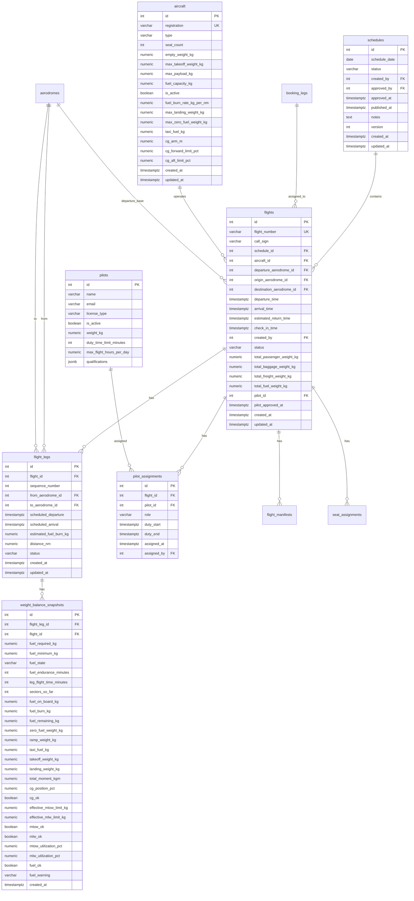

# Dynamic Scheduling & Flight Assignment — Architectural Plan

> **Project 2** of the FIGAS-remix-II aviation booking system.
> This document covers the complete data model, scheduling algorithm design, UI/UX design, workflow pipeline state machine, integration points with Project 1 (Booking), and component recommendations.
>
> **Prerequisite:** Project 1 (Booking Functionality) — see [`plans/booking-functionality-plan.md`](../plans/booking-functionality-plan.md)

---

## Table of Contents

1. [Data Model](#1-data-model)
2. [Scheduling Algorithm & Optimization Logic](#2-scheduling-algorithm--optimization-logic)
3. [User Interface Design](#3-user-interface-design)
4. [Workflow Pipeline](scheduling-workflow-pipeline.md)
5. [Integration Points with Project 1](scheduling-integration-points.md)
6. [UI Component Recommendations](scheduling-ui-components.md)
7. [Route Map](scheduling-route-map.md)
8. [Migration Plan](scheduling-migration-plan.md)

> **Note:** Sections 4-8 are in separate files for readability. See links above.

---

## 1. Data Model

### 1.1 Overview of Existing Schema

The existing database (from [`migrations/001_create_tables.sql`](../migrations/001_create_tables.sql) through [`migrations/004_add_timestamps_to_reference_tables.sql`](../migrations/004_add_timestamps_to_reference_tables.sql)) provides these relevant tables:

| Table | Purpose | Status for P2 |
|-------|---------|---------------|
| `flights` | Scheduled flights (single origin→destination) | ✅ Exists — extended as the sortie entity |
| `flight_manifests` | Load manifests per flight | ✅ Exists — linked via `flights.id` |
| `booking_legs` | Individual legs of a booking | ✅ Exists — `flight_id` is the P1→P2 link |
| `bookings` | Core booking record | ✅ Exists — status updated by P2 |
| `passengers` | Passengers on a booking | ✅ Exists — feeds manifest via joins |
| `seat_assignments` | Seat assignments per flight | ‚úÖ Exists |
| `aircraft` | Fleet aircraft specs | ✅ Exists — needs `fuel_burn_rate_kg_per_nm`, `max_landing_weight_kg`, `max_zero_fuel_weight_kg`, `cg_arm_m`, `cg_forward_limit_pct`, `cg_aft_limit_pct` |
| `pilots` | Pilot records | ✅ Exists — needs `weight_kg`, `duty_time_limit_minutes` |
| `aerodromes` | Airport/airstrip reference | ✅ Exists — needs `mtow_limit_kg`, `mlw_limit_kg` |
| `aerodrome_distances` | Distance matrix (nm) | ‚úÖ Exists |
| `aerodrome_headings` | Heading matrix (degrees) | ‚úÖ Exists |
| `fuel_rules` | Fuel calculation rules | ‚úÖ Exists |
| `airframe_hours` | Maintenance tracking | ✅ Exists — used for aircraft availability |
| `checkin_reminders` | Check-in tracking | ✅ Exists — feeds final manifest |
| `notifications` | Notification log | ✅ Exists — used for publish step |

### 1.2 Design Decision: One Coherent Strategy

**Chosen approach:** Extend the existing `flights` table as the sortie entity, and create `flight_legs` for sequenced stops. Do NOT create separate `sorties` or `sortie_legs` tables.

**Rationale:**
- A "sortie" IS a flight — it departs Stanley, visits intermediate stops, and returns to Stanley
- The existing `flights` table already has `intermediate_stops JSONB` — `flight_legs` replaces this with a proper relational model
- Existing code referencing `flights` continues to work with minimal changes
- `flight_legs` provides per-leg status tracking, weight snapshots, and SQL queryability
- Avoids schema bloat on `flights` — only a few columns are added, not 6+ nullable ones

**Rejected alternative:** Creating separate `schedules`/`sorties`/`sortie_legs` tables. This would duplicate the `flights` concept, create two parallel hierarchies, and require complex synchronization.

### 1.3 New Entities Required

#### 1.3.1 `schedules` Table (Daily Schedule Grouping)

Groups all flights for a single day into a versioned schedule with its own pipeline status.

```sql
CREATE TABLE IF NOT EXISTS schedules (
  id            SERIAL PRIMARY KEY,
  schedule_date DATE NOT NULL UNIQUE,
  status        VARCHAR(50) NOT NULL DEFAULT 'BUILDING',
    -- Values: BUILDING, APPROVED, PUBLISHED, PILOT_ASSIGNED,
    --         LOADSHEET_GENERATED, IN_PROGRESS, COMPLETED, CANCELLED
  created_by    INTEGER NOT NULL REFERENCES users(id),
  approved_by   INTEGER REFERENCES users(id),
  approved_at   TIMESTAMPTZ,
  published_at  TIMESTAMPTZ,
  notes         TEXT,
  version       INTEGER NOT NULL DEFAULT 1,
  created_at    TIMESTAMPTZ NOT NULL DEFAULT NOW(),
  updated_at    TIMESTAMPTZ NOT NULL DEFAULT NOW()
);

CREATE INDEX idx_schedules_date ON schedules(schedule_date);
CREATE INDEX idx_schedules_status ON schedules(status);
```

#### 1.3.2 Extend `flights` Table (Sortie-Level Columns)

The existing `flights` table becomes the **sortie** record. A flight now represents a multi-leg mission: departs Stanley ‚Üí visits stops ‚Üí returns to Stanley. The old `origin_aerodrome_id` / `destination_aerodrome_id` remain for backward compatibility but are superseded by `flight_legs` for multi-leg sorties.

```sql
ALTER TABLE flights ADD COLUMN IF NOT EXISTS call_sign VARCHAR(20);
ALTER TABLE flights ADD COLUMN IF NOT EXISTS schedule_id INTEGER REFERENCES schedules(id);
ALTER TABLE flights ADD COLUMN IF NOT EXISTS check_in_time TIMESTAMPTZ;
ALTER TABLE flights ADD COLUMN IF NOT EXISTS estimated_return_time TIMESTAMPTZ;
ALTER TABLE flights ADD COLUMN IF NOT EXISTS created_by INTEGER REFERENCES users(id);
ALTER TABLE flights ADD COLUMN IF NOT EXISTS departure_aerodrome_id INTEGER REFERENCES aerodromes(id);
  -- Always Stanley STY initially, but stored for flexibility
```

| Column | Type | Description |
|--------|------|-------------|
| `call_sign` | `VARCHAR(20)` | Human-readable call sign (e.g., `FIG-101`) |
| `schedule_id` | `INTEGER FK` | Reference to the daily schedule this sortie belongs to |
| `check_in_time` | `TIMESTAMPTZ` | Recommended passenger check-in time |
| `estimated_return_time` | `TIMESTAMPTZ` | Estimated time back at Stanley |
| `created_by` | `INTEGER FK` | User who created/optimized this sortie |
| `departure_aerodrome_id` | `INTEGER FK` | Always Stanley initially |

**Important:** The existing `FlightStatus` enum (`scheduled ‚Üí boarding ‚Üí in_progress ‚Üí completed ‚Üí cancelled`) remains unchanged for individual flight execution. The schedule-level pipeline status is tracked on the `schedules` table, not on `flights`.

#### 1.3.3 `flight_legs` Table (Sequenced Stops)

Each leg of a multi-stop sortie. Replaces the `intermediate_stops JSONB` column with a proper relational model.

```sql
CREATE TABLE IF NOT EXISTS flight_legs (
  id                  SERIAL PRIMARY KEY,
  flight_id           INTEGER NOT NULL REFERENCES flights(id) ON DELETE CASCADE,
  sequence_number     INTEGER NOT NULL,
  from_aerodrome_id   INTEGER NOT NULL REFERENCES aerodromes(id),
  to_aerodrome_id     INTEGER NOT NULL REFERENCES aerodromes(id),
  scheduled_departure TIMESTAMPTZ,
  scheduled_arrival   TIMESTAMPTZ,
  estimated_fuel_burn_kg NUMERIC(8,2),
  distance_nm         NUMERIC(8,2),
  status              VARCHAR(50) NOT NULL DEFAULT 'scheduled',
    -- Values: scheduled, in_progress, completed, cancelled
  created_at          TIMESTAMPTZ NOT NULL DEFAULT NOW(),
  updated_at          TIMESTAMPTZ NOT NULL DEFAULT NOW(),
  UNIQUE(flight_id, sequence_number)
);

CREATE INDEX idx_flight_legs_flight ON flight_legs(flight_id);
CREATE INDEX idx_flight_legs_from ON flight_legs(from_aerodrome_id);
CREATE INDEX idx_flight_legs_to ON flight_legs(to_aerodrome_id);
```

#### 1.3.4 `weight_balance_snapshots` Table (Per-Leg Computed Values)

Stores computed weight, fuel, and CG data per leg. Aircraft structural limits, aerodrome limits, and CG data are looked up dynamically at query time — only the computed values and the binding effective limits are stored.

```sql
CREATE TABLE IF NOT EXISTS weight_balance_snapshots (
  id                      SERIAL PRIMARY KEY,
  flight_leg_id           INTEGER NOT NULL REFERENCES flight_legs(id) ON DELETE CASCADE UNIQUE,
  flight_id               INTEGER NOT NULL REFERENCES flights(id) ON DELETE CASCADE,

  -- Fuel planning fields (computed per leg from fuel.csv lookup)
  fuel_required_kg        NUMERIC(8,2) NOT NULL DEFAULT 0,
    -- Fuel needed for this leg per fuel.csv Required Fuel column
  fuel_minimum_kg         NUMERIC(8,2) NOT NULL DEFAULT 0,
    -- Minimum fuel that must be on board before departure (fuel.csv Minimum Fuel column)
  fuel_state              VARCHAR(10),
    -- Fuel state string from fuel.csv (e.g., "35/35", "40/40") — what the refueler loads
  fuel_endurance_minutes  INTEGER NOT NULL DEFAULT 0,
    -- How long the fuel on board will last at planned burn rate
  leg_flight_time_minutes INTEGER NOT NULL DEFAULT 0,
    -- Scheduled flight time for this leg (distance / cruise_speed + taxi)
  sectors_so_far          INTEGER NOT NULL DEFAULT 0,
    -- Number of sectors completed including this leg (used for fuel.csv lookup)

  -- Fuel state tracking
  fuel_on_board_kg        NUMERIC(8,2) NOT NULL DEFAULT 0,
    -- Fuel on board at departure for this leg (the Fuel State value loaded at Stanley)
  fuel_burn_kg            NUMERIC(8,2) NOT NULL DEFAULT 0,
    -- Estimated fuel burn for this leg (= fuel.csv Required Fuel)
  fuel_remaining_kg       NUMERIC(8,2) NOT NULL DEFAULT 0,
    -- Fuel remaining after completing this leg

  -- Weight components
  zero_fuel_weight_kg     NUMERIC(8,2) NOT NULL DEFAULT 0,
    -- Aircraft empty weight + passengers + baggage + freight + pilot weight
  ramp_weight_kg          NUMERIC(8,2) NOT NULL DEFAULT 0,
  taxi_fuel_kg            NUMERIC(6,2) NOT NULL DEFAULT 5,
  takeoff_weight_kg       NUMERIC(8,2) NOT NULL DEFAULT 0,
  landing_weight_kg       NUMERIC(8,2) NOT NULL DEFAULT 0,

  -- CG (Center of Gravity) — simplified calculation
  total_moment_kgm        NUMERIC(10,2) NOT NULL DEFAULT 0,
    -- Sum of (weight √‚Äî arm) for all components
  cg_position_pct         NUMERIC(5,1),
    -- CG position as percentage of MAC: total_moment / total_weight
  cg_ok                   BOOLEAN NOT NULL DEFAULT true,
    -- TRUE if cg_forward_limit <= cg_position <= cg_aft_limit

  -- Effective (binding) constraints — MIN of aircraft and aerodrome limits
  effective_mtow_limit_kg NUMERIC(8,2) NOT NULL,
  effective_mlw_limit_kg  NUMERIC(8,2) NOT NULL,

  -- Checks against effective limits
  mtow_ok                 BOOLEAN NOT NULL DEFAULT true,
  mlw_ok                  BOOLEAN NOT NULL DEFAULT true,
  mtow_utilization_pct    NUMERIC(5,1),
  mlw_utilization_pct     NUMERIC(5,1),

  fuel_ok                 BOOLEAN NOT NULL DEFAULT true,
    -- TRUE if fuel_on_board_kg >= fuel_required_kg AND fuel_remaining_kg >= fuel_minimum_kg
  fuel_warning            VARCHAR(255),
  created_at              TIMESTAMPTZ NOT NULL DEFAULT NOW()
);

CREATE INDEX idx_weight_snapshots_leg ON weight_balance_snapshots(flight_leg_id);
CREATE INDEX idx_weight_snapshots_flight ON weight_balance_snapshots(flight_id);
```

**Key simplifications:**
- Unlike the original plan, this table does NOT store `aircraft_mtow_limit_kg`, `aircraft_mlw_limit_kg`, `aerodrome_mtow_limit_kg`, `aerodrome_mlw_limit_kg`, or `runway_length_m`. These are looked up dynamically from the `aircraft` and `aerodromes` tables. Only the computed effective limits are stored, avoiding data duplication and synchronization issues.
- Fuel planning uses the actual [`data/fuel.csv`](../data/fuel.csv) lookup: `fuel_required_kg` = Required Fuel, `fuel_minimum_kg` = Minimum Fuel (the reserve that must remain), `fuel_state` = Fuel State string (what the refueler loads at Stanley).
- CG calculation is simplified: `total_moment_kgm` stores the sum of (weight √‚Äî arm), `cg_position_pct` = total_moment / total_weight, and `cg_ok` checks against the aircraft's forward/aft CG limits.

#### 1.3.5 `pilot_assignments` Table

```sql
CREATE TABLE IF NOT EXISTS pilot_assignments (
  id          SERIAL PRIMARY KEY,
  flight_id   INTEGER NOT NULL REFERENCES flights(id) ON DELETE CASCADE,
  pilot_id    INTEGER NOT NULL REFERENCES pilots(id),
  role        VARCHAR(50) NOT NULL CHECK (role IN ('CAPTAIN', 'FIRST_OFFICER')),
  duty_start  TIMESTAMPTZ,
  duty_end    TIMESTAMPTZ,
  assigned_at TIMESTAMPTZ NOT NULL DEFAULT NOW(),
  assigned_by INTEGER REFERENCES users(id),
  UNIQUE(flight_id, pilot_id, role)
);

CREATE INDEX idx_pilot_assignments_flight ON pilot_assignments(flight_id);
CREATE INDEX idx_pilot_assignments_pilot ON pilot_assignments(pilot_id);
```

#### 1.3.6 Aircraft Scheduling Columns

```sql
ALTER TABLE aircraft ADD COLUMN IF NOT EXISTS fuel_burn_rate_kg_per_nm NUMERIC(6,2);
ALTER TABLE aircraft ADD COLUMN IF NOT EXISTS max_landing_weight_kg NUMERIC(7,1);
ALTER TABLE aircraft ADD COLUMN IF NOT EXISTS max_zero_fuel_weight_kg NUMERIC(7,1);
ALTER TABLE aircraft ADD COLUMN IF NOT EXISTS taxi_fuel_kg NUMERIC(6,2) NOT NULL DEFAULT 5;

-- CG (Center of Gravity) columns — admin-configurable via admin.aircraft.tsx
ALTER TABLE aircraft ADD COLUMN IF NOT EXISTS cg_arm_m NUMERIC(5,2);
  -- Center of Gravity arm in meters (moment arm for weight & balance)
ALTER TABLE aircraft ADD COLUMN IF NOT EXISTS cg_forward_limit_pct NUMERIC(4,1);
  -- Forward CG limit as percentage of MAC (Mean Aerodynamic Chord)
ALTER TABLE aircraft ADD COLUMN IF NOT EXISTS cg_aft_limit_pct NUMERIC(4,1);
  -- Aft CG limit as percentage of MAC (Mean Aerodynamic Chord)
```

#### 1.3.7 Pilot Scheduling Columns

```sql
ALTER TABLE pilots ADD COLUMN IF NOT EXISTS weight_kg NUMERIC(5,1);
  -- Pilot body weight in kg (used in weight & balance zero_fuel_weight calculation)
ALTER TABLE pilots ADD COLUMN IF NOT EXISTS duty_time_limit_minutes INTEGER NOT NULL DEFAULT 480;
ALTER TABLE pilots ADD COLUMN IF NOT EXISTS max_flight_hours_per_day NUMERIC(4,1) NOT NULL DEFAULT 8.0;
ALTER TABLE pilots ADD COLUMN IF NOT EXISTS qualifications JSONB;
```

#### 1.3.8 Aerodrome Weight Limit Columns

```sql
ALTER TABLE aerodromes ADD COLUMN IF NOT EXISTS mtow_limit_kg NUMERIC(7,1);
ALTER TABLE aerodromes ADD COLUMN IF NOT EXISTS mlw_limit_kg NUMERIC(7,1);
```

### 1.4 Complete Data Model Diagram



### 1.5 Key Design Decisions

| Decision | Rationale |
|----------|-----------|
| **Extend `flights` table** rather than create separate `sorties` table | A sortie IS a flight; minimizes schema changes; existing code continues to work |
| **Separate `flight_legs` table** rather than JSONB array | Enables per-leg status tracking, weight snapshots, and SQL queryability |
| **`weight_balance_snapshots` per leg** rather than computed on-the-fly | Computed once during scheduling; serves as audit trail for loadsheet; avoids recomputation |
| **No `flight_passenger_assignments` table** | Redundant — passengers are already linked to flights via `booking_legs.flight_id` → `bookings` → `passengers` |
| **No `flight_freight_assignments` table** | Redundant — freight data is on `booking_legs.freight_weight_kg` |
| **`schedules` table with versioning** | Supports what-if scenarios; allows rollback; audit trail for schedule changes |
| **Schedule status separate from FlightStatus** | Schedule status tracks the daily planning pipeline; FlightStatus tracks individual flight execution |
| **All PKs use `SERIAL`** | Consistent with existing schema; avoids UUID performance overhead |
| **Aircraft/aerodrome limits looked up dynamically** | Avoids data duplication and synchronization issues in weight snapshots |

### 1.6 ScheduleStatus ‚Üî FlightStatus Mapping

The schedule pipeline status and individual flight execution status are separate but related:

| Schedule Status | Flight Status | Notes |
|----------------|---------------|-------|
| `BUILDING` | — | Schedule being built, no flights created yet |
| `APPROVED` | — | Schedule approved, flights being created |
| `PUBLISHED` | `scheduled` | Flights visible to pilots and operations |
| `PILOT_ASSIGNED` | `scheduled` | Pilot assigned to each flight |
| `LOADSHEET_GENERATED` | `boarding` | Manifest created, ready for boarding |
| `IN_PROGRESS` | `in_progress` | At least one flight has departed |
| `COMPLETED` | `completed` | All flights completed |
| `CANCELLED` | `cancelled` | Schedule cancelled |

The schedule status and flight status are updated independently. A flight's status changes as it operates (board ‚Üí depart ‚Üí arrive); the schedule's status changes as it's planned and published.

---

## 2. Scheduling Algorithm & Optimization Logic

### 2.1 Problem Definition

This is a **time-constrained vehicle routing problem (VRP)** with these characteristics:

- **Single depot:** Stanley (STY) — all sorties depart from and return to Stanley
- **Heterogeneous fleet:** Multiple BN-2 Islander aircraft with different empty weights, fuel capacities, seat counts
- **Time windows:** Bookings have preferred time ranges (preferred_time_start ‚Üí preferred_time_end)
- **Capacity constraints:** Seat count, MTOW, MLW, fuel endurance per leg
- **Objective:** Minimize total flight time / fuel cost while serving all confirmed bookings
- **Schedule horizon:** One day at a time (scheduling is done the day prior)

### 2.2 Recommended Approach: Nearest-Neighbor Heuristic

Given the problem size (typically 5-20 bookings per day, 3-6 aircraft, 20+ aerodromes), an exact MILP solver is unnecessary. We recommend a **nearest-neighbor construction heuristic**.

**Why not 2-opt?** The maximum route size is ~10-15 aerodromes per sortie. The route is largely determined by passenger/freight demand, not pure distance optimization. A simple greedy nearest-neighbor is sufficient and more predictable. 2-opt can be added later if needed.

**Why not OR-Tools / MILP?**

| Factor | Assessment |
|--------|------------|
| Problem size | Small (≤20 bookings/day) — heuristic is sufficient |
| Development complexity | OR-Tools adds build complexity and JS integration overhead |
| Real-time requirements | Schedule is built once per day; even heuristic runs in <1s |
| Flexibility | Heuristic is easier to tune for FIGAS-specific rules (fuel rules, weight tracking) |

### 2.3 Algorithm Pseudocode

```
FUNCTION build_daily_schedule(date, bookings[], aircraft[], pilots[], aerodromes[], distances[][])
  INPUT:
    - date: target date
    - bookings[]: list of confirmed bookings with legs, passenger counts, weights, time preferences
    - aircraft[]: available aircraft with specs
    - pilots[]: available pilots with duty limits
    - aerodromes[]: all aerodromes with MTOW/MLW limits
    - distances[][]: distance matrix in nm

  OUTPUT:
    - flights[]: list of optimized flights (sorties), each with assigned aircraft, legs, passengers, weight snapshots

  // Phase 1: Group bookings by route proximity
  booking_clusters = cluster_bookings_by_proximity(bookings, distances)

  // Phase 2: For each cluster, construct initial flight route
  flights = []
  FOR EACH cluster IN booking_clusters:
    flight = construct_initial_route(cluster, aircraft, distances)
    flights.push(flight)

  // Phase 3: Assign aircraft to flights (bin packing)
  flights = assign_aircraft_to_flights(flights, aircraft)

  // Phase 4: Compute times, fuel plan, and weight snapshots
  FOR EACH flight IN flights:
    flight = compute_leg_times(flight, distances)
    flight = compute_fuel_plan(flight, aircraft, fuel_rules)
    flight = compute_weight_balance(flight, aircraft, aerodromes, fuel_rules)

  // Phase 5: Assign pilots respecting duty limits
  flights = assign_pilots_to_flights(flights, pilots)

  RETURN flights
```

### 2.4 Phase Details

#### Phase 1: Cluster Bookings by Route Proximity

Group bookings whose routes share common aerodromes or are geographically close.

```
FUNCTION cluster_bookings_by_proximity(bookings, distances):
  // Build adjacency graph: bookings are nodes, edge weight = distance between their destinations
  // Use greedy clustering:
  //   1. Pick unassigned booking with earliest preferred time
  //   2. Find all unassigned bookings whose destinations are within 30nm of current cluster's route
  //   3. Add them to cluster
  //   4. Repeat until all bookings assigned
  //
  // Constraint: max passengers per cluster <= max aircraft seat capacity (9)
  // Constraint: total cluster flight time <= max duty period
```

#### Phase 2: Construct Initial Route (Nearest-Neighbor)

```
FUNCTION construct_initial_route(bookings, aircraft, distances):
  // Start: Stanley (STY)
  // Route: STY -> stop1 -> stop2 -> ... -> stopN -> STY
  //
  // Algorithm:
  //   1. Start at STY
  //   2. From current location, find nearest unvisited booking destination
  //   3. Add that destination as next leg
  //   4. Check constraints (weight, fuel, seats)
  //   5. If constraints violated, return to STY and start new flight
  //   6. Repeat until all bookings in cluster are served
  //
  // Revisit Stanley: If optimal (e.g., to refuel or drop off passengers),
  //   insert STY as intermediate stop. This is triggered when:
  //   - Fuel remaining < fuel to next stop + reserve
  //   - Passenger count exceeds seats for remaining legs
```

#### Phase 3: Assign Aircraft (Bin Packing)

```
FUNCTION assign_aircraft_to_flights(flights, aircraft):
  // Sort flights by total payload weight (descending)
  // Sort aircraft by max_payload_kg (descending)
  // Greedy assignment: heaviest flight gets heaviest-capable aircraft
  //
  // Check:
  //   - seat_count >= max passengers on any leg
  //   - fuel_capacity_kg >= max fuel required
  //   - empty_weight_kg + payload <= MTOW
```

#### Phase 4: Compute Weight & Balance (with Fuel Planning)

For each leg of each flight, compute the weight snapshot. **Fuel is computed per leg** using the fuel rules table ([`data/fuel.csv`](../data/fuel.csv)), which maps flight time and sectors flown to required fuel and minimum fuel (reserve).

The fuel planning logic runs **before** other weight calculations because fuel weight affects takeoff weight, which determines whether the flight is feasible.

```
FUNCTION compute_weight_balance(flight, aircraft_spec, aerodromes[], fuel_rules[]):
  a/c = aircraft_spec
  fuel_on_board = 0  // Start with zero fuel; first leg loads fuel per rules

  FOR EACH leg IN flight.legs:
    // --- STEP 1: Compute flight time and sectors for fuel lookup ---
    flight_time_minutes = (leg.distance_nm / a/c.cruise_speed_kts) * 60 + a/c.taxi_time_minutes
    sectors_so_far = leg.sequence_number  // 1-based

    // --- STEP 2: Look up fuel rules for this leg ---
    fuel_rule = fuel_rules_lookup(flight_time_minutes, sectors_so_far, fuel_rules)

    // --- STEP 3: Determine fuel on board at departure ---
    IF leg.sequence_number == 1 OR leg.from_aerodrome == STANLEY:
      // At Stanley departure or revisit: load required fuel + contingency for this leg
      fuel_on_board = fuel_rule.required_fuel_kg + fuel_rule.minimum_fuel_kg
    ELSE:
      // Fuel carried forward from previous leg
      fuel_on_board = previous_leg.fuel_remaining_kg

    // --- STEP 4: Compute fuel burn for this leg ---
    leg_fuel_burn = fuel_rule.required_fuel_kg

    // --- STEP 5: Compute fuel remaining after leg ---
    fuel_remaining = fuel_on_board - leg_fuel_burn

    // --- STEP 6: Fuel endurance ---
    burn_rate_kg_per_min = leg_fuel_burn / max(flight_time_minutes, 1)
    fuel_endurance_minutes = IF burn_rate_kg_per_min > 0
                             THEN fuel_on_board / burn_rate_kg_per_min
                             ELSE 0

    // --- STEP 7: Fuel check ---
    fuel_ok = fuel_on_board >= (fuel_rule.required_fuel_kg + fuel_rule.minimum_fuel_kg)
    reserve_ok = fuel_remaining >= fuel_rule.minimum_fuel_kg

    // --- STEP 8: Compute zero fuel weight (payload only, no fuel) ---
    zero_fuel_weight = a/c.empty_weight_kg
                     + sum(passenger_weights on this leg)
                     + sum(freight_weights on this leg)
                     + sum(baggage_weights on this leg)

    // --- STEP 9: Compute weights with fuel ---
    ramp_weight = zero_fuel_weight + fuel_on_board
    takeoff_weight = ramp_weight - a/c.taxi_fuel_kg
    landing_weight = takeoff_weight - leg_fuel_burn

    // --- STEP 10: Look up destination aerodrome limits ---
    dest = aerodromes[leg.to_aerodrome_id]

    // Effective limits (binding constraint = the more restrictive)
    effective_mtow = MIN(a/c.max_takeoff_weight_kg, dest.mtow_limit_kg)
    effective_mlw  = MIN(a/c.max_landing_weight_kg, dest.mlw_limit_kg)

    // Runway derating: short runways reduce effective MTOW/MLW
    IF dest.runway_length_m IS NOT NULL AND dest.runway_length_m < 400:
      effective_mtow = effective_mtow * 0.95
      effective_mlw  = effective_mlw * 0.95

    // Check constraints against effective limits
    mtow_ok = takeoff_weight <= effective_mtow
    mlw_ok  = landing_weight <= effective_mlw

    // Utilization percentages
    mtow_util_pct = (takeoff_weight / effective_mtow) * 100
    mlw_util_pct  = (landing_weight / effective_mlw) * 100

    // --- STEP 11: If overweight, reduce payload ---
    // Fuel is a consequence of the route, not a variable to optimize against weight.
    // If overweight, reduce payload (passengers/freight) — not increase fuel.
    IF NOT mtow_ok:
      // Reduce payload first (passengers/baggage/freight)
      // If payload is at minimum, reduce fuel to minimum required
      // Recalculate weights
      // Repeat until convergence or minimum service determined

    // --- STEP 12: Store snapshot ---
    leg.weight_snapshot = {
      fuel_required: fuel_rule.required_fuel_kg,
      fuel_contingency: fuel_rule.minimum_fuel_kg,
      fuel_endurance_minutes: fuel_endurance_minutes,
      leg_flight_time_minutes: flight_time_minutes,
      sectors_so_far: sectors_so_far,
      fuel_on_board: fuel_on_board,
      fuel_burn: leg_fuel_burn,
      fuel_remaining: fuel_remaining,
      zero_fuel_weight: zero_fuel_weight,
      ramp_weight: ramp_weight,
      taxi_fuel: a/c.taxi_fuel_kg,
      takeoff_weight: takeoff_weight,
      landing_weight: landing_weight,
      effective_mtow_limit: effective_mtow,
      effective_mlw_limit: effective_mlw,
      mtow_ok: mtow_ok,
      mlw_ok: mlw_ok,
      mtow_utilization_pct: mtow_util_pct,
      mlw_utilization_pct: mlw_util_pct,
      fuel_ok: fuel_ok AND reserve_ok,
      fuel_warning: fuel_ok ? null : "Insufficient fuel"
    }

    // --- STEP 13: Update fuel for next leg ---
    IF leg.to_aerodrome == STANLEY AND NOT last_leg:
      // Refuel at Stanley: handled at top of next iteration
      PASS
```

#### Phase 5: Assign Pilots

```
FUNCTION assign_pilots_to_flights(flights, pilots):
  // For each flight, assign captain + first officer
  // Constraints:
  //   - Pilot duty time <= duty_time_limit_minutes
  //   - Pilot must have appropriate qualifications
  //   - Pilot must not be assigned to overlapping flights
  //   - Pilot weight_kg is included in zero_fuel_weight calculation (see Phase 4)
  //
  // Algorithm:
  //   1. Sort flights by departure time
  //   2. For each flight, find available pilot pair
  //   3. Prefer pilots with least duty time used so far (load balancing)
  //   4. After assignment, re-run weight & balance to include pilot weight
  //      in zero_fuel_weight calculation
```

### 2.5 Fuel Planning Logic — Simplified fuel.csv Direct Lookup

The fuel planning logic computes fuel loads per leg using a direct lookup into [`data/fuel.csv`](../data/fuel.csv). This replaces both the previous "full fuel" assumption AND the earlier "required fuel + contingency" approach with a simpler, more accurate model.

**Key insight from fuel.csv:**
- **Required Fuel** is the calculated fuel needed for the leg (the burn)
- **Minimum Fuel** is what the fuel is rounded up to — the "Fuel State" column (e.g., `35/35`, `40/40`) is what the refueler will use
- The algorithm: compute flight time + sectors ‚Üí look up Required Fuel ‚Üí round up to Minimum Fuel ‚Üí use Fuel State as the actual fuel load

#### Fuel CSV Lookup Algorithm

```
FUNCTION fuel_csv_lookup(flight_time_minutes, sectors_so_far, fuel_rules[]):
  // fuel_rules is the data from fuel.csv sorted by (flight_time, sectors)
  // Find the row where FT mins >= computed flight time AND Sectors >= sectors_so_far
  // using ceiling match (conservative — round up)

  // Step 1: Filter candidates where sectors >= sectors_so_far
  candidates = fuel_rules.filter(r => r.sectors >= sectors_so_far)

  IF candidates is empty:
    // No sector match; use the maximum sector entry
    candidates = fuel_rules.filter(r =>
      r.sectors == max(fuel_rules.sectors)
    )

  // Step 2: Find the row with flight_time >= our flight_time (ceiling match)
  best = candidates.filter(r => r.flight_time_minutes >= flight_time_minutes)
                   .sort_by_asc(r.flight_time_minutes)
                   .first()

  IF best is null:
    // Flight time exceeds all entries; use the maximum entry
    best = candidates.sort_by_desc(r.flight_time_minutes).first()

  RETURN {
    required_fuel_kg: best.required_fuel,    // fuel.csv Required Fuel column
    minimum_fuel_kg: best.minimum_fuel,       // fuel.csv Minimum Fuel column
    fuel_state: best.fuel_state               // fuel.csv Fuel State column (e.g., "35/35")
  }
```

#### Per-Leg Fuel Computation

```
FUNCTION compute_fuel_plan(flight, aircraft, fuel_rules[]):
  // Fuel planning runs BEFORE weight-balance computation
  // because fuel weight affects takeoff weight
  // The fuel.csv IS the fuel calculation — no separate burn rate needed

  FOR EACH leg IN flight.legs:
    // Step 1: Compute flight time for this leg
    flight_time_minutes = (leg.distance_nm / aircraft.cruise_speed_kts) * 60
                        + aircraft.taxi_time_minutes

    // Step 2: Determine sectors flown so far (including this leg)
    sectors_so_far = leg.sequence_number  // 1-based

    // Step 3: Look up fuel rules from fuel.csv
    fuel_rule = fuel_csv_lookup(flight_time_minutes, sectors_so_far, fuel_rules)

    // Step 4: Determine fuel on board at departure
    IF leg.sequence_number == 1:
      // First leg from Stanley: load the Fuel State value (Minimum Fuel)
      fuel_on_board = fuel_rule.minimum_fuel_kg
    ELSE IF leg.from_aerodrome == STANLEY:
      // Revisit Stanley: reload per fuel.csv for the next segment
      fuel_on_board = fuel_rule.minimum_fuel_kg
    ELSE:
      // Intermediate leg: carry forward remaining fuel
      fuel_on_board = previous_leg.fuel_remaining_kg

    // Step 5: Compute fuel burn for this leg (= Required Fuel from fuel.csv)
    leg_fuel_burn = fuel_rule.required_fuel_kg

    // Step 6: Compute fuel remaining after leg
    fuel_remaining = fuel_on_board - leg_fuel_burn

    // Step 7: Compute fuel endurance
    burn_rate_kg_per_min = leg_fuel_burn / max(flight_time_minutes, 1)
    fuel_endurance_minutes = IF burn_rate_kg_per_min > 0
                             THEN fuel_on_board / burn_rate_kg_per_min
                             ELSE 0

    // Step 8: Fuel check
    // fuel_ok: fuel_on_board must be >= required fuel for the leg
    fuel_ok = fuel_on_board >= fuel_rule.required_fuel_kg
    // reserve_ok: remaining fuel after leg must be >= minimum fuel (reserve)
    reserve_ok = fuel_remaining >= fuel_rule.minimum_fuel_kg

    // Step 9: Store fuel plan on leg
    leg.fuel_plan = {
      flight_time_minutes: flight_time_minutes,
      sectors_so_far: sectors_so_far,
      fuel_required: fuel_rule.required_fuel_kg,
      fuel_minimum: fuel_rule.minimum_fuel_kg,
      fuel_state: fuel_rule.fuel_state,
      fuel_on_board: fuel_on_board,
      fuel_burn: leg_fuel_burn,
      fuel_remaining: fuel_remaining,
      fuel_endurance_minutes: fuel_endurance_minutes,
      fuel_ok: fuel_ok AND reserve_ok
    }

    // Step 10: If fuel check fails, trigger Stanley revisit
    IF NOT fuel_ok OR NOT reserve_ok:
      MARK leg as needing Stanley revisit

  RETURN flight with fuel plans attached to each leg
```

### 2.6 Revisit Stanley Logic

A flight may revisit Stanley mid-route if:

1. **Fuel constraint:** Fuel remaining is insufficient for the next leg + reserves
2. **Passenger dropoff/pickup:** Optimal to drop off passengers at Stanley and pick up new ones
3. **Weight constraint:** Landing weight at next destination would exceed MLW
4. **Operational decision:** Scheduler manually inserts a Stanley stop

When a Stanley revisit is inserted:
- The flight now has a leg ending at Stanley
- Fuel is loaded to the required amount for the next segment per fuel rules lookup
- Passengers destined for post-Stanley stops remain on board
- Passengers whose destination is Stanley disembark
- New passengers from Stanley board

#### Fuel Planning Algorithm File

A new algorithm file [`app/utils/scheduling/fuel-planning.ts`](app/utils/scheduling/fuel-planning.ts) will implement the fuel planning logic using direct fuel.csv lookup:

| Function | Description |
|----------|-------------|
| `fuelCsvLookup(flightTimeMinutes, sectors, fuelRules[])` | Look up Required Fuel, Minimum Fuel, and Fuel State from fuel.csv data using ceiling-match on both flight time and sectors |
| `computeFuelPlan(flight, aircraft, fuelRules[])` | Compute fuel loads for each leg of a flight using fuel.csv direct lookup |
| `checkFuelEndurance(leg, fuelPlan)` | Verify fuel on board is sufficient for the leg + reserve |
| `shouldRevisitStanley(leg, fuelPlan, aircraft)` | Determine if a Stanley revisit is needed due to fuel constraints |

---

## 3. User Interface Design

### 3.1 Aviation Color Palette

| Role | Color | Hex | Usage |
|------|-------|-----|-------|
| **Primary** | Deep Blue | `#0B3D5B` | Headers, primary buttons, active states, instrument-panel backgrounds |
| **Primary Light** | Sky Blue | `#E0F2FE` | Selected rows, info badges |
| **Alert/Error** | Signal Red | `#D32F2F` | Weight limit exceeded, fuel warnings, cancellations |
| **Warning** | Amber | `#FF8F00` | Near-limits, cautions, pending states |
| **Success** | Aviation Green | `#2E7D32` | Confirmed, completed, within limits |
| **Background** | Aviation Gray | `#F5F5F5` | Page backgrounds, card surfaces |
| **Text** | Dark Gray | `#616161` | Body text |
| **Text Strong** | Near Black | `#1A1A1A` | Headings, data values |

### 3.2 Typography

```css
/* Data displays — instrument panel style */
.data-display {
  font-family: 'JetBrains Mono', 'Courier New', monospace;
  font-size: 0.875rem;
  letter-spacing: 0.025em;
}

/* Body text — clear sans-serif */
body {
  font-family: 'Inter', -apple-system, BlinkMacSystemFont, sans-serif;
}

/* Labels and metadata */
.label {
  font-family: 'Inter', sans-serif;
  font-size: 0.75rem;
  font-weight: 600;
  text-transform: uppercase;
  letter-spacing: 0.05em;
  color: #616161;
}
```

### 3.3 Layout Architecture

The scheduling UI lives under `/operations/schedule/*` and uses the existing [`SidebarLayout`](../app/components/SidebarLayout.tsx) pattern.

**Main scheduling page layout:**

```
+----------------------------------------------------------------------+
|  [PageHeader] Schedule Builder — [Date Selector]  [Workflow Toolbar]  |
+----------------------------------------------------------------------+
|  [Schedule Overview — Timeline List View]                             |
|  +------------------------------------------------------------------+ |
|  | 08:00  VP-FBD | Sortie A: STY‚ÜíMPA‚ÜíPGR‚ÜíSTY  ‚ñà‚ñà‚ñà‚ñà‚ñà‚ñà‚ñà‚ñà‚ñà‚ñà‚ñà‚ñà         | |
|  | 09:30  VP-FMC | Sortie B: STY‚ÜíPSY‚ÜíFBE‚ÜíSTY         ‚ñà‚ñà‚ñà‚ñà‚ñà‚ñà‚ñà‚ñà      | |
|  | 10:00  VP-FBN | Sortie C: STY‚ÜíNWI‚ÜíCCI‚ÜíSTY              ‚ñà‚ñà‚ñà‚ñà‚ñà‚ñà‚ñà‚ñà | |
|  +------------------------------------------------------------------+ |
+----------------------------------------------------------------------+
|  [Sortie Board — Form-Based Assignment]                                |
|  +------------------+  +------------------+  +------------------+     |
|  | Unassigned Pool  |  | Sortie 1         |  | Sortie 2         |     |
|  | [Booking A]      |  | [Booking B]      |  | [Booking D]      |     |
|  | [Booking C]      |  | [Booking E]      |  |                  |     |
|  | [Booking F]      |  |                  |  |                  |     |
|  +------------------+  +------------------+  +------------------+     |
+----------------------------------------------------------------------+
```

### 3.4 Page Designs

#### 3.4.1 Schedule Builder (Main View)

**Route:** `/operations/schedule`

This is the primary scheduling interface with three panels:

1. **Top toolbar:** Date selector, workflow stage buttons, auto-build trigger
2. **Timeline list view:** Chronological list of flights with visual time indicators
3. **Sortie board:** Form-based assignment of bookings to flights using dropdowns and action buttons

```
+----------------------------------------------------------------------+
|  Schedule: [15 May 2026 ▼]  [Auto-Build]  [Approve]  [Publish]       |
|  Status: Building ‚‚Äîè‚‚Äîè‚‚Äîè‚‚Äîã‚‚Äîã‚‚Äîã‚‚Äîã‚‚Äîã‚‚Äîã‚‚Äîã‚‚Äîã‚‚Äîã                                       |
+----------------------------------------------------------------------+
|  Timeline: 08:00    09:00    10:00    11:00    12:00    13:00        |
|  VP-FBD   |‚ñà‚ñà‚ñà‚ñà‚ñà‚ñà‚ñà‚ñà‚ñà‚ñà‚ñà‚ñë‚ñë‚ñë‚ñë‚ñë‚ñë‚ñë‚ñë‚ñë‚ñë‚ñë‚ñë‚ñë‚ñë‚ñë‚ñë‚ñë‚ñë‚ñë‚ñë‚ñë‚ñë‚ñë‚ñë‚ñë‚ñë‚ñë‚ñë‚ñë‚ñë‚ñë‚ñë‚ñë‚ñë‚ñë‚ñë‚ñë‚ñë‚ñë‚ñë‚ñë‚ñë|   |
|           | Sortie 1: STY‚ÜíMPA‚ÜíPGR‚ÜíSTY                               |   |
|  VP-FMC   |‚ñë‚ñë‚ñë‚ñë‚ñë‚ñë‚ñë‚ñë‚ñë‚ñë‚ñë‚ñë‚ñë‚ñë‚ñà‚ñà‚ñà‚ñà‚ñà‚ñà‚ñà‚ñà‚ñà‚ñà‚ñà‚ñà‚ñà‚ñà‚ñà‚ñë‚ñë‚ñë‚ñë‚ñë‚ñë‚ñë‚ñë‚ñë‚ñë‚ñë‚ñë‚ñë‚ñë‚ñë‚ñë‚ñë‚ñë‚ñë‚ñë‚ñë‚ñë‚ñë‚ñë|   |
|           | Sortie 2: STY‚ÜíPSY‚ÜíFBE‚ÜíSTY                               |   |
|  VP-FBN   |‚ñë‚ñë‚ñë‚ñë‚ñë‚ñë‚ñë‚ñë‚ñë‚ñë‚ñë‚ñë‚ñë‚ñë‚ñë‚ñë‚ñë‚ñë‚ñë‚ñë‚ñë‚ñë‚ñë‚ñë‚ñë‚ñë‚ñë‚ñë‚ñë‚ñë‚ñë‚ñë‚ñà‚ñà‚ñà‚ñà‚ñà‚ñà‚ñà‚ñà‚ñà‚ñà‚ñà‚ñà‚ñà‚ñà‚ñà‚ñà‚ñà‚ñà‚ñà‚ñë‚ñë‚ñë|   |
|           | Sortie 3: STY‚ÜíNWI‚ÜíCCI‚ÜíSTY                               |   |
+----------------------------------------------------------------------+
|  [Unassigned]    [Sortie 1: VP-FBD]    [Sortie 2: VP-FMC]           |
|  +------------+  +------------------+  +------------------+          |
|  | BKG-001    |  | BKG-002          |  | BKG-005          |          |
|  | PSA‚ÜíMPN    |  | MPA‚ÜíPGR          |  | PSY‚ÜíFBE          |          |
|  | 2 pax      |  | 3 pax            |  | 1 pax            |          |
|  | 09:00-10:00|  | 08:30-09:30      |  | 10:00-11:00      |          |
|  | [Assign‚ñæ]  |  | [Remove] [Move‚ñæ] |  | [Remove] [Move‚ñæ] |          |
|  +------------+  |                  |  |                  |          |
|  | BKG-004    |  | BKG-003          |  |                  |          |
|  | PSA‚ÜíMPN    |  | PGR‚ÜíSTY          |  |                  |          |
|  | 1 pax      |  | 2 pax            |  |                  |          |
|  | 10:00-11:00|  | 10:30-11:00      |  |                  |          |
|  | [Assign‚ñæ]  |  | [Remove] [Move‚ñæ] |  |                  |          |
|  +------------+  +------------------+  +------------------+          |
+----------------------------------------------------------------------+
```

**Key difference from original plan:** Uses `@dnd-kit/core` and `@dnd-kit/sortable` for visual drag-and-drop, but form submission happens **on drop** (not on every drag event). When a booking card is dropped onto a flight column, that triggers a single form submission (POST with the `booking_id` and `target_flight_id`). This keeps the Remix mutation pattern intact while providing smooth drag-and-drop UX.

The ScheduleBoard uses `@dnd-kit` for visual drag-and-drop:
- `DndContext` wraps the board with `onDragEnd` handler
- `useSortable` on each booking card enables drag
- `useDroppable` on each flight column defines drop zones
- On `onDragEnd`, collect the result and submit a Remix `<Form>` via `useSubmit()` or a hidden form
- No client-side state management for drag positions — the server is the source of truth

#### 3.4.2 Sortie Detail Panel (Right Sidebar)

**Triggered by:** Clicking a sortie in the timeline or sortie board.

```
+------------------------------------------+
| Sortie 1 — VP-FBD                        |
| [Edit] [Delete] [Approve]                |
+------------------------------------------+
| Aircraft: VP-FBD (BN-2 Islander)         |
| Pilot: J. Smith (Captain)                |
| First Officer: A. Brown                  |
| Departure: 08:30 from Stanley (STY)      |
| Return: ~12:00 to Stanley (STY)          |
+------------------------------------------+
| Legs:                                     |
| 1. STY ‚Üí MPA  08:30-09:00  45nm  120kg  |
| 2. MPA ‚Üí PGR  09:15-09:45  30nm   80kg  |
| 3. PGR ‚Üí STY  10:00-10:30  50nm  130kg  |
+------------------------------------------+
| Weight Summary:                           |
| Empty:  1,990 kg                         |
| Pax:      240 kg (3 pax √‚Äî 80 kg)         |
| Bag:      60 kg                          |
| Freight:  120 kg                         |
| Fuel:     330 kg                         |
| ---                                      |
| Ramp:   2,740 kg                         |
| Effective MTOW: 2,790 kg  ‚Üê aerodrome    |
| MTOW: ██████████████░░  98%  ⚠️ Amber   |
| Effective MLW:  2,760 kg  ‚Üê aerodrome    |
| MLW:  ‚ñà‚ñà‚ñà‚ñà‚ñà‚ñà‚ñà‚ñà‚ñà‚ñà‚ñë‚ñë‚ñë‚ñë‚ñë‚ñë  83%  ‚úÖ Green   |
| Runway: 500 m                            |
+------------------------------------------+
| Bookings in this sortie:                  |
| [BKG-002] MPA‚ÜíPGR  3 pax  [Remove]      |
| [BKG-003] PGR‚ÜíSTY  2 pax  [Remove]      |
+------------------------------------------+
```

#### 3.4.3 Flight Detail View (Post-Publish)

**Route:** `/operations/flights/:flightId`

Once a schedule is published, each flight leg already exists as a `Flight` record (since we extend `flights`, not create separate sorties). This view adds scheduling context:

- **Breadcrumb:** Schedule ‚Üí Flight FIG-101 (STY‚ÜíMPA)
- **Additional fields:** Schedule reference, linked booking legs, weight snapshot
- **Actions:** Board, Depart, Arrive, Cancel (existing workflow)

#### 3.4.4 Schedule List View

**Route:** `/operations/schedule/list`

A tabular alternative to the timeline view, useful for reviewing multiple days:

| Column | Content |
|--------|---------|
| Date | Schedule date |
| Flights | Count of flights (sorties) |
| Aircraft | Registrations assigned |
| Bookings | Count of bookings assigned |
| Status | BUILDING / APPROVED / PUBLISHED / PILOT_ASSIGNED / LOADSHEET_GENERATED |
| Actions | View, Edit, Approve, Publish |

Uses the existing [`DataTable`](../app/components/DataTable.tsx) component with schedule-specific columns.

### 3.5 Status Indicators

| Status | Badge Color | Description |
|--------|-------------|-------------|
| `BUILDING` | Amber (`#FF8F00`) | Schedule is being constructed, bookings being assigned |
| `APPROVED` | Blue (`#0B3D5B`) | Schedule approved by operations manager |
| `PUBLISHED` | Green (`#2E7D32`) | Flights generated, visible to pilots and customers |
| `PILOT_ASSIGNED` | Teal (`#00897B`) | Pilots have been assigned to each flight |
| `LOADSHEET_GENERATED` | Purple (`#7B1FA2`) | Loadsheets created for each flight |
| `IN_PROGRESS` | Blue (`#1976D2`) | At least one flight in the schedule has departed |
| `COMPLETED` | Gray (`#616161`) | All flights in the schedule completed |
| `CANCELLED` | Red (`#D32F2F`) | Schedule cancelled |

### 3.6 Responsive Design Considerations

- **Desktop (‚â•1024px):** Full three-panel layout (timeline + sortie board + detail sidebar)
- **Tablet (768-1023px):** Timeline collapses to list view; sortie board becomes stacked; detail sidebar becomes full-screen overlay
- **Mobile (<768px):** Single-column layout; schedule list replaces timeline; sortie detail is a separate page