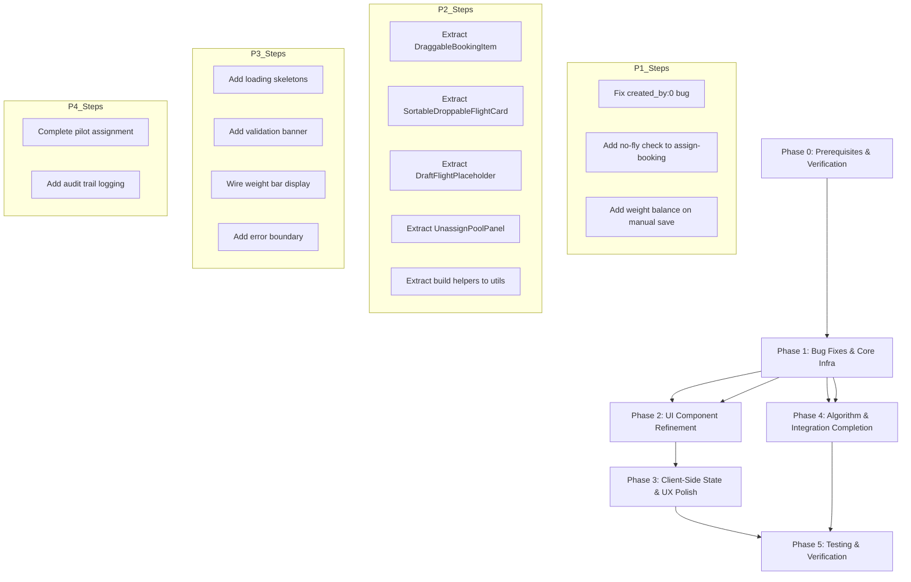

# FIGAS Flight Scheduling — Implementation Plan

**Status:** Deprecated

> **⚠️ DEPRECATED — Do not use.** This plan contains incorrect claims and has been superseded by [`plans/scheduling-audit-report.md`](plans/scheduling-audit-report.md) and the production documentation in `docs/`. See [`plans/documentation-harmonization-plan.md`](plans/documentation-harmonization-plan.md) for the current documentation structure.

---

## Table of Contents

1. [Current Codebase State](#1-current-codebase-state)
2. [Phase Overview & Dependency Graph](#2-phase-overview--dependency-graph)
3. [Phase 0 — Prerequisites & Verification](#3-phase-0--prerequisites--verification)
4. [Phase 1 — Bug Fixes & Core Infrastructure](#4-phase-1--bug-fixes--core-infrastructure)
5. [Phase 2 — UI Component Refinement](#5-phase-2--ui-component-refinement)
6. [Phase 3 — Client-Side State & UX Polish](#6-phase-3--client-side-state--ux-polish)
7. [Phase 4 — Algorithm & Integration Completion](#7-phase-4--algorithm--integration-completion)
8. [Phase 5 — Testing & Verification](#8-phase-5--testing--verification)
9. [Risk Assessment](#9-risk-assessment)

---

## 1. Current Codebase State

### 1.1 What's Already Built (Verified by Codebase Analysis)

| Area | Status | Details |
|------|--------|---------|
| **`@dnd-kit` packages** | ✅ Installed | `@dnd-kit/core@^6.3.1`, `@dnd-kit/sortable@^10.0.0`, `@dnd-kit/utilities@^3.2.2` in `package.json` |
| **Route file** | ✅ Complete | [`app/routes/operations.schedule._index.tsx`](app/routes/operations.schedule._index.tsx) — 980 lines, full loader, action dispatcher, DnD context, optimistic updates with rollback |
| **Action handlers** | ✅ Complete | [`app/utils/schedule-handlers.server.ts`](app/utils/schedule-handlers.server.ts) — All 11 handlers: auto-build, approve, revise, publish, cancel, reorder-flights, create-flight, assign-booking, create-flight-from-booking, unassign-booking, assign-pilot |
| **Schedule repository** | ✅ Complete | [`app/utils/repositories/schedule.ts`](app/utils/repositories/schedule.ts) — CRUD + `updateStatus()` with audit fields |
| **Schedule server repository** | ✅ Complete | [`app/utils/repositories/schedule.server.ts`](app/utils/repositories/schedule.server.ts) — `findWithStats()`, `findOrCreate()`, `findUpcomingWithStats()` |
| **Flight repository (shared)** | ✅ Complete | [`app/utils/repositories/flight.ts`](app/utils/repositories/flight.ts) — `findById()`, `assignPilot()`, `updateWeights()`, `deleteFlight()` with transaction |
| **Flight server repository** | ✅ Complete | [`app/utils/repositories/flight.server.ts`](app/utils/repositories/flight.server.ts) — `create()`, `update()`, `delete()` with cascade |
| **Flight leg repository** | ✅ Complete | [`app/utils/repositories/flight-leg.ts`](app/utils/repositories/flight-leg.ts) — CRUD + `replaceFlightLegs()` transaction |
| **Booking leg repository (shared)** | ✅ Complete | [`app/utils/repositories/booking-leg.ts`](app/utils/repositories/booking-leg.ts) — CRUD + `assignFlight()`, `countByFlightId()`, `findUnassignedLegs()` |
| **Booking leg server repository** | ✅ Complete | [`app/utils/repositories/booking-leg.server.ts`](app/utils/repositories/booking-leg.server.ts) — `findUnassignedByDate()`, `findByFlightId()`, `countUnassignedByDate()` |
| **Booking leg passenger repository** | ✅ Complete | [`app/utils/repositories/booking-leg-passenger.ts`](app/utils/repositories/booking-leg-passenger.ts) — Full CRUD with `findByBookingId()`, `findByLegId()`, `checkIn()`, `deleteByLegId()` |
| **Pilot assignment repository** | ✅ Complete | [`app/utils/repositories/pilot-assignment.ts`](app/utils/repositories/pilot-assignment.ts) — CRUD + `findByFlightId()`, `findByScheduleId()`, `updateStatus()` |
| **Weight balance repository** | ✅ Complete | [`app/utils/repositories/weight-balance.ts`](app/utils/repositories/weight-balance.ts) — CRUD |
| **Scheduling engine (5-phase)** | ✅ Complete | [`app/utils/scheduling/index.ts`](app/utils/scheduling/index.ts) — `buildSchedule()` orchestrator |
| **Phase 1: Cluster** | ✅ Complete | [`app/utils/scheduling/cluster-bookings.ts`](app/utils/scheduling/cluster-bookings.ts) |
| **Phase 2: Nearest-neighbor** | ✅ Complete | [`app/utils/scheduling/nearest-neighbor.ts`](app/utils/scheduling/nearest-neighbor.ts) |
| **Phase 3: Assign aircraft** | ✅ Complete | [`app/utils/scheduling/assign-aircraft.ts`](app/utils/scheduling/assign-aircraft.ts) |
| **Phase 4: Weight & balance** | ✅ Complete | [`app/utils/scheduling/weight-balance.ts`](app/utils/scheduling/weight-balance.ts) |
| **Phase 5: Assign pilots** | ⚠️ Stub | [`app/utils/scheduling/assign-pilots.ts`](app/utils/scheduling/assign-pilots.ts) — uses hardcoded defaults |
| **Fuel data** | ✅ Complete | [`app/utils/scheduling/fuel-data.ts`](app/utils/scheduling/fuel-data.ts) |
| **Fuel planning** | ✅ Complete | [`app/utils/scheduling/fuel-planning.ts`](app/utils/scheduling/fuel-planning.ts) |
| **Flight validation** | ✅ Complete | [`app/utils/scheduling/flight-validation.ts`](app/utils/scheduling/flight-validation.ts) — 659 lines, pure client-side |
| **Insert passenger route** | ✅ Complete | [`app/utils/scheduling/insert-passenger-route.ts`](app/utils/scheduling/insert-passenger-route.ts) — optimal route insertion algorithm |
| **Suggest route** | ✅ Complete | [`app/utils/scheduling/suggest-route.ts`](app/utils/scheduling/suggest-route.ts) — 335 lines with caching |
| **Types** | ✅ Complete | [`app/utils/scheduling/types.ts`](app/utils/scheduling/types.ts) — All interfaces |
| **No-fly service** | ✅ Complete | [`app/utils/services/no-fly.service.ts`](app/utils/services/no-fly.service.ts) — 405 lines |
| **Toast system** | ✅ Complete | [`app/utils/toast.ts`](app/utils/toast.ts) — `showToast()`, `useToast()`, `useToastState()` |
| **FlightCard component** | ✅ Complete | [`app/components/schedule/FlightCard.tsx`](app/components/schedule/FlightCard.tsx) — 479 lines, validation integration |
| **ScheduleBoard component** | ✅ Complete | [`app/components/schedule/ScheduleBoard.tsx`](app/components/schedule/ScheduleBoard.tsx) — Sortable DnD board |
| **ScheduleStatusBar component** | ✅ Complete | [`app/components/schedule/ScheduleStatusBar.tsx`](app/components/schedule/ScheduleStatusBar.tsx) |
| **RouteStrip component** | ✅ Complete | [`app/components/schedule/RouteStrip.tsx`](app/components/schedule/RouteStrip.tsx) — 207 lines |
| **StopActivityList component** | ✅ Complete | [`app/components/schedule/StopActivityList.tsx`](app/components/schedule/StopActivityList.tsx) — 375 lines |
| **FlightCrew component** | ✅ Exists | [`app/components/schedule/FlightCrew.tsx`](app/components/schedule/FlightCrew.tsx) |
| **FlightTiming component** | ✅ Exists | [`app/components/schedule/FlightTiming.tsx`](app/components/schedule/FlightTiming.tsx) |
| **FlightNotes component** | ✅ Exists | [`app/components/schedule/FlightNotes.tsx`](app/components/schedule/FlightNotes.tsx) |
| **WeightSummary component** | ✅ Exists | [`app/components/schedule/WeightSummary.tsx`](app/components/schedule/WeightSummary.tsx) |
| **PilotAssignmentPanel component** | ✅ Exists | [`app/components/schedule/PilotAssignmentPanel.tsx`](app/components/schedule/PilotAssignmentPanel.tsx) |
| **OptimizationBar component** | ✅ Exists | [`app/components/schedule/OptimizationBar.tsx`](app/components/schedule/OptimizationBar.tsx) |
| **TimelineView component** | ✅ Exists | [`app/components/schedule/TimelineView.tsx`](app/components/schedule/TimelineView.tsx) |
| **Empty flight cleanup** | ✅ Implemented | In [`handleUnassignBooking()`](app/utils/schedule-handlers.server.ts:404-414) |
| **Optimistic update rollback** | ✅ Implemented | In [`ScheduleBuilder`](app/routes/operations.schedule._index.tsx:686-701) via `pendingOpsRef` |
| **Permission checks** | ✅ Implemented | In [`action()`](app/routes/operations.schedule._index.tsx:265-396) via `requireActionPermission()` |
| **Schedule status flow** | ✅ Implemented | `handleApprove()`, `handleRevise()`, `handlePublish()`, `handleCancel()` in [`schedule-handlers.server.ts`](app/utils/schedule-handlers.server.ts) |

### 1.2 What's Missing / Needs Work

| # | Issue | Location | Severity |
|---|-------|----------|----------|
| 1 | **`created_by: 0` hardcoded** | [`scheduling/index.ts:31`](app/utils/scheduling/index.ts:31) — default parameter `createdBy: number = 0` | **High** — produces orphan records |
| 2 | **Pilot assignment is a stub** | [`assign-pilots.ts`](app/utils/scheduling/assign-pilots.ts) — `getPilotAvailabilities()` returns hardcoded defaults | **High** — real pilot scheduling data not queried |
| 3 | **No weight balance display in FlightCard** | [`FlightCard.tsx`](app/components/schedule/FlightCard.tsx) — validation is computed but weight bar visualization may not be wired | **Medium** — UX gap |
| 4 | **No validation result banner in route** | [`operations.schedule._index.tsx`](app/routes/operations.schedule._index.tsx) — validation warnings not rendered in the main UI | **Medium** — UX gap |
| 5 | **No loading/skeleton states** | Route file and components — no dedicated loading skeletons | **Low** — UX polish |
| 6 | **No audit trail for status changes** | [`schedule.ts`](app/utils/repositories/schedule.ts) — `updateStatus()` writes audit fields but no separate audit log table | **Low** — nice-to-have |
| 7 | **Weight balance snapshots not created on manual flight save** | Only created during auto-build in [`scheduling/index.ts`](app/utils/scheduling/index.ts:136-160) | **Medium** — data inconsistency |
| 8 | **No-fly day check not in all mutation handlers** | Only in `handleAutoBuild()`, `handleCreateFlight()`, `handleCreateFlightFromBooking()` | **Medium** — missing in `handleAssignBooking()` |
| 9 | **`DraftFlightPlaceholder` and `UnassignPoolPanel` are in route file** | [`operations.schedule._index.tsx:581-658`](app/routes/operations.schedule._index.tsx:581) — should be extracted to components | **Low** — code organization |
| 10 | **`buildStopActivities()` and `buildFlightCardFlight()` are in route file** | [`operations.schedule._index.tsx:448-549`](app/routes/operations.schedule._index.tsx:448) — should be extracted to utils | **Low** — code organization |
| 11 | **`DraggableBookingItem` is in route file** | [`operations.schedule._index.tsx:400-428`](app/routes/operations.schedule._index.tsx:400) — should be extracted | **Low** — code organization |
| 12 | **`SortableDroppableFlightCard` is in route file** | [`operations.schedule._index.tsx:553-577`](app/routes/operations.schedule._index.tsx:553) — should be extracted | **Low** — code organization |
| 13 | **No empty state for schedule with no flights** | Route file has basic empty state but could be improved | **Low** — UX polish |
| 14 | **No error boundary for scheduling route** | No dedicated error boundary for the scheduling page | **Low** — resilience |

---

## 2. Phase Overview & Dependency Graph

---

## 3. Phase 0 — Prerequisites & Verification

### Step 0.1: Verify `@dnd-kit` Package Installation

- **File:** [`package.json`](package.json)
- **Action:** Verify
- **Purpose:** Confirm the three `@dnd-kit` packages are installed and resolvable
- **Details:** Check that `@dnd-kit/core@^6.3.1`, `@dnd-kit/sortable@^10.0.0`, `@dnd-kit/utilities@^3.2.2` are in `node_modules`. Run `npm ls @dnd-kit/core` to verify. If missing, run `npm install`.
- **Verification:** `npm ls @dnd-kit/core` exits with code 0
- **Side Effects:** None

### Step 0.2: Verify Prisma Schema Sync

- **File:** [`prisma/schema.prisma`](prisma/schema.prisma)
- **Action:** Verify
- **Purpose:** Ensure the Prisma schema matches the database
- **Details:** Run `npx prisma validate` to check schema validity. Run `npx prisma db push --dry-run` to check for drift between schema and database.
- **Verification:** Both commands exit with code 0 and no drift detected
- **Side Effects:** None

### Step 0.3: Verify Database Migrations Are Applied

- **File:** [`migrations/consolidated/004-scheduling.sql`](migrations/consolidated/004-scheduling.sql)
- **Action:** Verify
- **Purpose:** Ensure all scheduling-related migrations have been applied to the database
- **Details:** Check the `_migrations` table or run a quick query to verify `schedules`, `flight_legs`, `pilot_assignments`, `weight_balance_snapshots` tables exist
- **Verification:** All tables exist with expected columns
- **Side Effects:** None

### Step 0.4: Verify TypeScript Compilation

- **File:** `tsconfig.json`
- **Action:** Verify
- **Purpose:** Ensure the codebase compiles without errors before making changes
- **Details:** Run `npx tsc --noEmit` to check for type errors
- **Verification:** Compilation succeeds
- **Side Effects:** None

---

## 4. Phase 1 — Bug Fixes & Core Infrastructure

### Step 1.1: Fix `created_by: 0` Hardcoded Default

- **File:** [`app/utils/scheduling/index.ts`](app/utils/scheduling/index.ts)
- **Action:** Modify
- **Purpose:** The `buildSchedule()` function has `createdBy: number = 0` as a default parameter. When called without a real user ID, it creates schedule records with `created_by: 0`, which is an orphan reference.
- **Details:**
  - Change line 31 from `export async function buildSchedule(date: string, createdBy: number = 0)` to remove the default value: `export async function buildSchedule(date: string, createdBy: number)`
  - Update the JSDoc comment to reflect that `createdBy` is required
  - Check all callers: [`schedule-handlers.server.ts:40`](app/utils/schedule-handlers.server.ts:40) calls `buildSchedule(date, createdBy)` — this already passes the real user ID from the action context. No other callers exist.
- **Dependencies:** None
- **Side Effects:** If any code calls `buildSchedule(date)` without the second argument, it will now fail at compile time. This is intentional — it forces callers to provide a real user ID.
- **Verification:** `npx tsc --noEmit` succeeds. The auto-build action still works end-to-end.

### Step 1.2: Add No-Fly Day Check to `handleAssignBooking()`

- **File:** [`app/utils/schedule-handlers.server.ts`](app/utils/schedule-handlers.server.ts)
- **Action:** Modify
- **Purpose:** The `handleAssignBooking()` handler does not check for no-fly days before assigning a booking to a flight. If a schedule exists for a no-fly day, bookings could be assigned to flights on that day.
- **Details:**
  - In [`handleAssignBooking()`](app/utils/schedule-handlers.server.ts:268), add a no-fly check before the route insertion logic
  - Load the flight to get its `schedule_id`, then load the schedule to get the date
  - Call `isNoFlyDay(schedule.schedule_date)` and return an error if true
  - Pattern to follow: [`handleCreateFlight()`](app/utils/schedule-handlers.server.ts:239-245) already does this
- **Dependencies:** None
- **Side Effects:** Assigning bookings on no-fly days will now be rejected with a 400 error
- **Verification:** Unit test: attempt to assign a booking on a no-fly day, verify error response

### Step 1.3: Add No-Fly Day Check to `handleUnassignBooking()`

- **File:** [`app/utils/schedule-handlers.server.ts`](app/utils/schedule-handlers.server.ts)
- **Action:** Modify
- **Purpose:** Same as Step 1.2 — unassigning bookings on no-fly days should also be prevented
- **Details:**
  - In [`handleUnassignBooking()`](app/utils/schedule-handlers.server.ts:394), add a no-fly check
  - Load the booking leg to get `flight_id`, then load the flight to get `schedule_id`, then load the schedule to get the date
  - Call `isNoFlyDay()` and return an error if true
- **Dependencies:** None
- **Side Effects:** Unassigning bookings on no-fly days will now be rejected
- **Verification:** Unit test: attempt to unassign a booking on a no-fly day, verify error response

### Step 1.4: Add Weight Balance Snapshot Creation on Manual Flight Save

- **File:** [`app/utils/schedule-handlers.server.ts`](app/utils/schedule-handlers.server.ts)
- **Action:** Modify
- **Purpose:** Weight balance snapshots are only created during auto-build (Phase 4 of the scheduling engine). When a user manually creates a flight or assigns a booking, no weight balance snapshot is created, leading to data inconsistency.
- **Details:**
  - In [`handleAssignBooking()`](app/utils/schedule-handlers.server.ts:268), after successfully assigning the booking and updating legs, call the weight balance computation
  - Import `computeWeightBalanceForRoute` from [`app/utils/scheduling/weight-balance.ts`](app/utils/scheduling/weight-balance.ts)
  - Import `weightBalanceRepository` from [`app/utils/repositories/weight-balance.ts`](app/utils/repositories/weight-balance.ts)
  - After `flightLegRepository.replaceFlightLegs()`, compute weight balance for the updated legs and save a snapshot
  - Pattern to follow: [`scheduling/index.ts:132-160`](app/utils/scheduling/index.ts:132-160)
- **Dependencies:** Step 1.1 (for `createdBy` user ID)
- **Side Effects:** Manual flight saves will now create weight balance snapshots, increasing DB writes but improving data consistency
- **Verification:** After assigning a booking, verify a `weight_balance_snapshots` record exists for the flight

---

## 5. Phase 2 — UI Component Refinement

### Step 2.1: Extract `DraggableBookingItem` to Dedicated Component

- **File:** Create `app/components/schedule/DraggableBookingItem.tsx`
- **Action:** Create
- **Purpose:** The `DraggableBookingItem` component is currently defined inline in the route file at [`operations.schedule._index.tsx:400-428`](app/routes/operations.schedule._index.tsx:400). Extract it to a reusable component.
- **Details:**
  - Create new file with the component accepting `UnassignedBookingRow` as a prop
  - Move the `useDraggable` hook and JSX from the route file
  - Export the component and the `UnassignedBookingRow` interface (or import it from a shared types file)
  - Import and use in the route file instead of the inline definition
- **Dependencies:** None
- **Side Effects:** Route file size reduces by ~30 lines
- **Verification:** The unassigned pool panel still renders draggable booking items correctly

### Step 2.2: Extract `SortableDroppableFlightCard` to Dedicated Component

- **File:** Create `app/components/schedule/SortableDroppableFlightCard.tsx`
- **Action:** Create
- **Purpose:** The `SortableDroppableFlightCard` component is defined inline at [`operations.schedule._index.tsx:553-577`](app/routes/operations.schedule._index.tsx:553). Extract it.
- **Details:**
  - Create new file with the component accepting `FlightSummaryRow`, `FlightLegRow[]`, `PassengerManifestRow[]`, `onDrop` callback, and permission props
  - Move the `useDroppable` hook and JSX
  - Import `FlightCard` and `buildFlightCardFlight` (which will be extracted in Step 2.5)
- **Dependencies:** Step 2.5 (build helpers extraction)
- **Side Effects:** Route file size reduces by ~25 lines
- **Verification:** Flight cards in the schedule board still accept drops correctly

### Step 2.3: Extract `DraftFlightPlaceholder` to Dedicated Component

- **File:** Create `app/components/schedule/DraftFlightPlaceholder.tsx`
- **Action:** Create
- **Purpose:** The `DraftFlightPlaceholder` component is defined inline at [`operations.schedule._index.tsx:581-628`](app/routes/operations.schedule._index.tsx:581). Extract it.
- **Details:**
  - Create new file with the component accepting `isDraggingBooking`, `onDrop`, and `scheduleId` props
  - Move the `useDroppable` hook and JSX
- **Dependencies:** None
- **Side Effects:** Route file size reduces by ~48 lines
- **Verification:** The draft flight placeholder still renders and accepts drops

### Step 2.4: Extract `UnassignPoolPanel` to Dedicated Component

- **File:** Create `app/components/schedule/UnassignPoolPanel.tsx`
- **Action:** Create
- **Purpose:** The `UnassignPoolPanel` component is defined inline at [`operations.schedule._index.tsx:632-658`](app/routes/operations.schedule._index.tsx:632). Extract it.
- **Details:**
  - Create new file with the component accepting `unassignedBookings` and `visibleCount` props
  - Move the `useState` for `showAll` and the JSX
  - Import `DraggableBookingItem` (from Step 2.1) and `EmptyState`
- **Dependencies:** Step 2.1 (DraggableBookingItem extraction)
- **Side Effects:** Route file size reduces by ~27 lines
- **Verification:** The unassigned pool panel still renders and the "Show all" toggle works

### Step 2.5: Extract `buildStopActivities()` and `buildFlightCardFlight()` to Utils

- **File:** Create `app/utils/scheduling/build-helpers.ts`
- **Action:** Create
- **Purpose:** The `buildStopActivities()` and `buildFlightCardFlight()` functions are defined inline at [`operations.schedule._index.tsx:448-549`](app/routes/operations.schedule._index.tsx:448). Extract them to a shared utility file.
- **Details:**
  - Create new file with both functions exported
  - Move the `StopActivity`, `FlightSummaryRow`, `FlightLegRow`, `PassengerManifestRow` interfaces (or import them from a shared types file)
  - Import `formatCompactName` from [`app/utils/format-compact-name.ts`](app/utils/format-compact-name.ts)
  - Import `FlightCardFlight` type from [`app/components/schedule/FlightCard.tsx`](app/components/schedule/FlightCard.tsx)
- **Dependencies:** None
- **Side Effects:** Route file size reduces by ~100 lines. These functions become reusable by other routes.
- **Verification:** The schedule board still renders flight cards with correct stop activities and manifests

---

## 6. Phase 3 — Client-Side State & UX Polish

### Step 3.1: Add Loading Skeleton for Schedule Board

- **File:** [`app/components/schedule/ScheduleBoard.tsx`](app/components/schedule/ScheduleBoard.tsx)
- **Action:** Modify
- **Purpose:** When the schedule is loading or being rebuilt, the board should show skeleton placeholders instead of a blank area.
- **Details:**
  - Add a `loading` prop to `ScheduleBoardProps`
  - When `loading` is true, render 3 skeleton flight card placeholders (animated pulse divs with approximate FlightCard dimensions)
  - Pattern: use Tailwind `animate-pulse` and `bg-slate-200` classes, matching the existing pattern in [`RouteStrip.tsx:30`](app/components/schedule/RouteStrip.tsx:30)
- **Dependencies:** None
- **Side Effects:** None
- **Verification:** Set `loading=true` on ScheduleBoard, verify skeleton cards appear

### Step 3.2: Add Validation Result Banner to Schedule Page

- **File:** [`app/routes/operations.schedule._index.tsx`](app/routes/operations.schedule._index.tsx)
- **Action:** Modify
- **Purpose:** When flights have validation warnings or violations (weight, range, seat constraints), the user should see a summary banner at the top of the schedule page.
- **Details:**
  - After the `ScheduleStatusBar`, add a collapsible `ValidationSummaryBanner` component
  - The banner aggregates validation results from all flights
  - Shows count of warnings vs violations
  - Clicking expands to show per-flight details
  - Use the existing `FlightValidationResult` type from [`flight-validation.ts`](app/utils/scheduling/flight-validation.ts)
  - The validation data is already computed in `FlightCard` via `useEffect` — this step wires it up to the parent
  - Consider using a React context or lifting state up to share validation results
- **Dependencies:** None
- **Side Effects:** Adds a new visual element to the schedule page
- **Verification:** Create a flight with weight violations, verify the banner appears with correct counts

### Step 3.3: Wire Weight Bar Visualization in FlightCard

- **File:** [`app/components/schedule/FlightCard.tsx`](app/components/schedule/FlightCard.tsx)
- **Action:** Verify and modify if needed
- **Purpose:** The `FlightCard` already imports `WeightBar` from `../WeightBar` (line 4) and computes validation data. Verify that the weight bar is actually rendered and wired to the validation results.
- **Details:**
  - Check if `WeightBar` is rendered in the JSX of `FlightCard` (around line 127+)
  - If not, add it below the route strip, showing MTOW utilization percentage
  - Use the `perStopValidation` data from `FlightValidationResult` to color-code the bar
  - Green: <= 80%, Amber: > 80% and < 100%, Red: >= 100%
- **Dependencies:** None
- **Side Effects:** Flight cards will show a visual weight utilization bar
- **Verification:** A flight with passengers and an aircraft assigned shows a weight bar

### Step 3.4: Add Error Boundary for Scheduling Route

- **File:** Create `app/routes/operations.schedule._index.tsx` (add error boundary export)
- **Action:** Modify
- **Purpose:** The scheduling route should have a dedicated error boundary to catch rendering errors gracefully.
- **Details:**
  - Export an `ErrorBoundary` function from the route file (Remix convention)
  - Display a user-friendly error message with a "Go back to dashboard" link
  - Log the error to console for debugging
  - Pattern: follow the existing [`GlobalErrorBoundary`](app/components/GlobalErrorBoundary.tsx) pattern
- **Dependencies:** None
- **Side Effects:** Rendering errors in the schedule page will show a friendly error instead of a blank page
- **Verification:** Temporarily throw an error in the component, verify the error boundary renders

---

## 7. Phase 4 — Algorithm & Integration Completion

### Step 4.1: Complete Pilot Assignment (Replace Stub)

- **File:** [`app/utils/scheduling/assign-pilots.ts`](app/utils/scheduling/assign-pilots.ts)
- **Action:** Modify
- **Purpose:** The `getPilotAvailabilities()` function currently returns hardcoded defaults (line 122-131). It needs to query real pilot scheduling data from the database.
- **Details:**
  - The `pilots` table has columns: `id`, `name`, `is_active`, and scheduling-related columns
  - Query the `pilots` table for: `current_duty_hours`, `current_flight_hours`, `medical_due_date`, `license_type`
  - Query the `pilot_assignments` table to check if pilots are already assigned to other flights on the same date
  - Implement proper availability logic:
    - Pilot must be `is_active = true`
    - Pilot must have valid medical certification (`medical_due_date > scheduleDate`)
    - Pilot must have sufficient remaining duty hours (`current_duty_hours + estimatedFlightTimeHours <= maxDutyHoursPerDay`)
    - Pilot must not be assigned to overlapping flights on the same date
  - Sort by `current_duty_hours` ascending for fair distribution (already implemented)
  - Assign captain as the pilot with the most experience (highest flight hours or license type)
  - Assign first officer as the next available pilot
  - If only one pilot is available, assign as captain and log a warning
- **Dependencies:** None
- **Side Effects:** Auto-build will now assign real pilots instead of defaults. May fail if no pilots are available.
- **Verification:** Run auto-build with available pilots, verify `pilot_assignments` records are created with correct pilot IDs

### Step 4.2: Add Audit Trail Logging for Schedule Status Changes

- **File:** [`app/utils/repositories/schedule.ts`](app/utils/repositories/schedule.ts)
- **Action:** Modify
- **Purpose:** When a schedule changes status (draft→approved→published→cancelled), the change should be logged for audit purposes.
- **Details:**
  - The `schedules` table already has audit columns: `approved_by`, `approved_at`, `published_by`, `published_at`, `cancelled_by`, `cancelled_at`, `cancellation_reason`
  - The `updateStatus()` method already writes to these columns (lines 73-109)
  - Verify that all status transitions in [`schedule-handlers.server.ts`](app/utils/schedule-handlers.server.ts) pass the correct user ID:
    - `handleApprove()` line 92: passes `approvedBy` ✓
    - `handleRevise()` line 113-122: clears audit fields ✓
    - `handlePublish()` line 171: passes `publishedBy` ✓
    - `handleCancel()` line 195-198: passes `cancelledBy` and `cancellationReason` ✓
  - If a dedicated `schedule_audit_log` table is desired, create a migration and repository, but this is out of scope for now — the existing audit columns are sufficient
- **Dependencies:** None
- **Side Effects:** None — this is a verification step with minor fixes if needed
- **Verification:** Approve a schedule, verify `approved_by` and `approved_at` are set on the schedule record

---

## 8. Phase 5 — Testing & Verification

### Step 5.1: Test Schedule Status Flow

- **Scope:** [`schedule-handlers.server.ts`](app/utils/schedule-handlers.server.ts) — `handleApprove()`, `handleRevise()`, `handlePublish()`, `handleCancel()`
- **Purpose:** Verify the complete schedule lifecycle: draft → approve → publish → revise → approve → cancel
- **Test Cases:**
  1. Create a schedule (draft status)
  2. Approve a schedule with no flights → should fail with 400
  3. Create flights with bookings, then approve → should succeed
  4. Publish an approved schedule → should succeed
  5. Revise a published schedule → should revert to draft
  6. Approve the revised schedule → should succeed
  7. Cancel the approved schedule → should succeed
  8. Cancel a cancelled schedule → should fail with 400
  9. Approve a cancelled schedule → should fail with 400
  10. Cancel a schedule in "building" status → should succeed
  11. Publish a schedule that is not approved → should fail with 400
  12. Revise a schedule that is not published → should fail with 400
- **Verification:** All 12 test cases pass. The schedule status transitions follow the state machine defined in the architectural specification.

### Step 5.2: Test Drag-and-Drop Assignment Flow

- **Scope:** [`operations.schedule._index.tsx`](app/routes/operations.schedule._index.tsx) — `handleDragEnd()`, `handleDropOnFlight()`, `handleReorderFlight()`
- **Purpose:** Verify that drag-and-drop assignment of bookings to flights works correctly, including optimistic updates and rollback.
- **Test Cases:**
  1. Drag an unassigned booking onto an existing flight → booking appears in the flight's stop manifest
  2. Drag an unassigned booking onto the "Draft Flight" placeholder → a new flight is created with the booking
  3. Reorder flights by dragging → sort_order is updated in the database
  4. Drag
