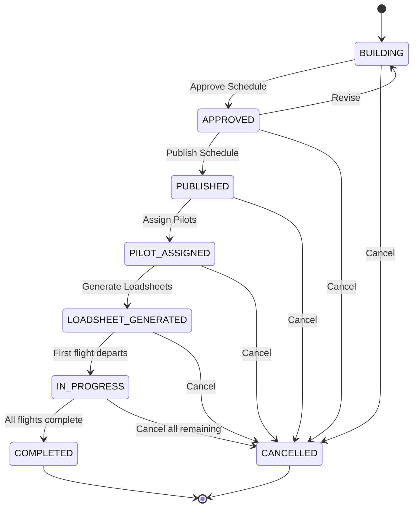

# Scheduling Workflow Pipeline

> Part of the Dynamic Scheduling & Flight Assignment plan.
> See main plan at [`scheduling-flight-assignment-plan.md`](scheduling-flight-assignment-plan.md)

## 4.1 State Machine

The scheduling workflow follows a pipeline with eight stages. The schedule status is tracked on the `schedules` table and is **separate** from the existing `FlightStatus` enum (which tracks individual flight execution).



**Key features:**
- Cancellation is valid from any stage (with audit trail)
- Reversion from APPROVED back to BUILDING is allowed (with audit trail)
- No reversion from PUBLISHED or later stages (would require cancelling and recreating)

## 4.2 ScheduleStatus ↔ FlightStatus Mapping

The schedule pipeline status and individual flight execution status are separate enums that are updated independently:

| Schedule Status | Flight Status | Notes |
|----------------|---------------|-------|
| `BUILDING` | — | Schedule being built, no flights created yet |
| `APPROVED` | — | Schedule approved, flights being created |
| `PUBLISHED` | `scheduled` | Flights visible to pilots and operations |
| `PILOT_ASSIGNED` | `scheduled` | Pilot assigned to each flight |
| `LOADSHEET_GENERATED` | `boarding` | Manifest created, ready for boarding |
| `IN_PROGRESS` | `in_progress` | At least one flight has departed |
| `COMPLETED` | `completed` | All flights completed |
| `CANCELLED` | `cancelled` | Schedule cancelled |

**How it works:**
- When schedule is `PUBLISHED`, all associated flights get `status = 'scheduled'`
- When schedule is `IN_PROGRESS`, flights that have departed get `status = 'in_progress'`
- When schedule is `COMPLETED`, all flights get `status = 'completed'`
- When schedule is `CANCELLED`, all flights get `status = 'cancelled'`
- Individual flights can also be cancelled independently (e.g., weather cancellation of a single leg)

## 4.3 Stage Details

### Stage 1: BUILDING

| Aspect | Detail |
|--------|--------|
| **Who** | Operations scheduler |
| **Entry** | New schedule created for a date |
| **Actions** | Auto-build (algorithm), assign bookings via dropdowns, edit flights, manual override |
| **Side effects** | **Fuel planning computed during auto-build:** For each flight leg, the algorithm computes fuel loads via direct lookup in [`data/fuel.csv`](../data/fuel.csv) using flight time and sectors flown. The CSV provides `required_fuel_kg`, `minimum_fuel_kg`, and `fuel_state` directly — no separate burn rate calculation is needed. Fuel is NOT assumed full; it is calculated per leg. See [`scheduling-flight-assignment-plan.md`](scheduling-flight-assignment-plan.md) Section 2.5 for the fuel planning algorithm. |
| **Exit** | Click "Approve" → transitions to APPROVED |

### Stage 2: APPROVED

| Aspect | Detail |
|--------|--------|
| **Who** | Operations manager |
| **Entry** | Schedule approved by manager |
| **Actions** | Review flights, edit if needed (returns to BUILDING), publish |
| **Side effects** | `schedules.approved_by` and `schedules.approved_at` are set |
| **Exit** | Click "Publish" → transitions to PUBLISHED. Click "Revise" → returns to BUILDING. |

### Stage 3: PUBLISHED

| Aspect | Detail |
|--------|--------|
| **Who** | System (auto) |
| **Entry** | Schedule published |
| **Actions** | View flights, assign pilots manually or auto-assign |
| **Side effects** | **Flight status updated:** All flights in the schedule get `status = 'scheduled'`. `schedules.published_at` is set. Booking legs are linked via `booking_legs.flight_id`. Customers receive notifications via the existing [`notificationRepository`](../app/utils/repositories/notification.ts). |
| **Exit** | Pilots assigned → transitions to PILOT_ASSIGNED |

**Flight status update logic:**

```
FUNCTION publish_schedule(schedule_id):
  schedule = get_schedule(schedule_id)
  FOR EACH flight IN schedule.flights:
    // Update flight status to scheduled
    flightRepository.updateStatus(flight.id, 'scheduled')

    // Link booking legs to this flight
    FOR EACH leg IN flight.legs:
      FOR EACH booking_leg IN leg.booking_legs:
        bookingLegRepository.assignFlight(booking_leg.id, flight.id)

    // Update booking status to FLIGHT_ASSIGNED
    FOR EACH booking IN flight.bookings:
      bookingRepository.updateStatus(booking.id, 'flight_assigned')

  // Set published_at timestamp
  scheduleRepository.updatePublishedAt(schedule.id)

  // Send notifications
  FOR EACH flight IN schedule.flights:
    FOR EACH booking IN flight.bookings:
      notificationRepository.create({
        booking_id: booking.id,
        flight_id: flight.id,
        type: 'flight_assigned',
        recipient_email: booking.user.email,
        subject: 'Flight Assigned - ' + flight.flight_number,
        message: 'Your flight has been scheduled...'
      })
```

### Stage 4: PILOT_ASSIGNED

| Aspect | Detail |
|--------|--------|
| **Who** | Operations scheduler or auto-assign |
| **Entry** | Pilots assigned to all flights |
| **Actions** | View pilot assignments, generate loadsheets |
| **Side effects** | Pilots receive notifications with their schedule via [`notificationRepository`](../app/utils/repositories/notification.ts) |
| **Exit** | Loadsheets generated → transitions to LOADSHEET_GENERATED |

### Stage 5: LOADSHEET_GENERATED

| Aspect | Detail |
|--------|--------|
| **Who** | System (auto) |
| **Entry** | Loadsheets created for each flight |
| **Actions** | Print loadsheets, view final weights |
| **Side effects** | Weight snapshots stored in `weight_balance_snapshots` table. Flight status updated to `boarding`. |
| **Exit** | First flight departs → transitions to IN_PROGRESS |

### Stage 6: IN_PROGRESS

| Aspect | Detail |
|--------|--------|
| **Who** | System (auto) |
| **Entry** | First flight in schedule departs |
| **Actions** | Monitor flight progress |
| **Side effects** | Flight status updated to `in_progress` for departed flights |
| **Exit** | All flights complete → transitions to COMPLETED |

### Stage 7: COMPLETED

| Aspect | Detail |
|--------|--------|
| **Who** | System (auto) |
| **Entry** | All flights in schedule completed |
| **Actions** | Review, archive |
| **Side effects** | All flight statuses set to `completed` |
| **Exit** | Terminal state |

### Stage 8: CANCELLED

| Aspect | Detail |
|--------|--------|
| **Who** | Operations manager |
| **Entry** | Manual cancellation from any stage |
| **Actions** | Provide cancellation reason |
| **Side effects** | If PUBLISHED+, all linked flights are cancelled first. Notifications sent to affected customers and pilots. |
| **Exit** | Terminal state |

## 4.4 Status Transition Validation

| Transition | Validation Rules |
|------------|------------------|
| BUILDING → APPROVED | All flights must have at least one booking leg assigned. No overlapping flights for same aircraft. Fuel planning must be computed for all legs (fuel_required_kg, fuel_minimum_kg, fuel_state must be populated). |
| APPROVED → PUBLISHED | Schedule must have been approved by an authorized user. |
| APPROVED → BUILDING | Requires reason (audit trail). Only allowed from APPROVED, not from later stages. |
| PUBLISHED → PILOT_ASSIGNED | Every flight must have a captain assigned. Pilot duty times must not exceed limits. |
| PILOT_ASSIGNED → LOADSHEET_GENERATED | All weight snapshots must pass MTOW/MLW/fuel/CG checks. MTOW/MLW checks use **effective limits** (MIN of aircraft structural limit and destination aerodrome limit). See [`scheduling-flight-assignment-plan.md`](scheduling-flight-assignment-plan.md) Phase 4 for the per-aerodrome lookup logic. **Fuel checks use simplified fuel.csv lookup:** `fuel_ok` must be TRUE for all legs, meaning `fuel_on_board_kg >= fuel_required_kg` (fuel_on_board is the `minimum_fuel_kg` value from fuel.csv, which already includes reserve). **CG checks:** `cg_ok` must be TRUE for all legs, meaning `cg_forward_limit_pct <= cg_position_pct <= cg_aft_limit_pct`. |
| Any → CANCELLED | Requires reason. If PUBLISHED+, all linked flights must be cancelled first. Notifications sent. |

## 4.5 Notification Triggers

| Transition | Notification | Recipients | Via |
|------------|-------------|------------|-----|
| BUILDING → APPROVED | None (internal ops) | — | — |
| APPROVED → PUBLISHED | "Flight assigned" notification | Customers with bookings on affected flights | [`notificationRepository`](../app/utils/repositories/notification.ts) |
| PUBLISHED → PILOT_ASSIGNED | "Pilot schedule" notification | Assigned pilots | [`notificationRepository`](../app/utils/repositories/notification.ts) |
| PILOT_ASSIGNED → LOADSHEET_GENERATED | "Loadsheet ready" notification | Operations staff | [`notificationRepository`](../app/utils/repositories/notification.ts) |
| IN_PROGRESS → COMPLETED | "Flight completed" notification | Operations staff | [`notificationRepository`](../app/utils/repositories/notification.ts) |
| Any → CANCELLED | "Flight cancelled" notification | Affected customers and pilots | [`notificationRepository`](../app/utils/repositories/notification.ts) |

## 4.6 Cancellation and Reversion Handling

### Cancellation
- Valid from any pipeline stage
- Requires a reason (stored in `schedules.notes`)
- If PUBLISHED or later:
  - All flights with `status = 'scheduled'` or `status = 'boarding'` are set to `cancelled`
  - Flights already `in_progress` or `completed` are NOT cancelled (partial schedule cancellation)
  - Notifications sent to affected customers and pilots
- If BUILDING or APPROVED:
  - No flights exist yet, so no flight-level changes needed

### Reversion
- Only valid from APPROVED back to BUILDING
- Requires a reason (stored in `schedules.notes`)
- `schedules.approved_by` and `schedules.approved_at` are cleared
- The schedule version is incremented
- All previous approvals are invalidated

### Partial Sortie Completion
- Individual flight legs can be cancelled independently (e.g., weather at destination)
- The `flight_legs.status` column tracks per-leg status
- A flight is considered `completed` when all its legs are `completed` or `cancelled`
- A flight is considered `cancelled` when all its legs are `cancelled`
- A flight with mixed leg statuses (some completed, some cancelled) is considered `partial`
