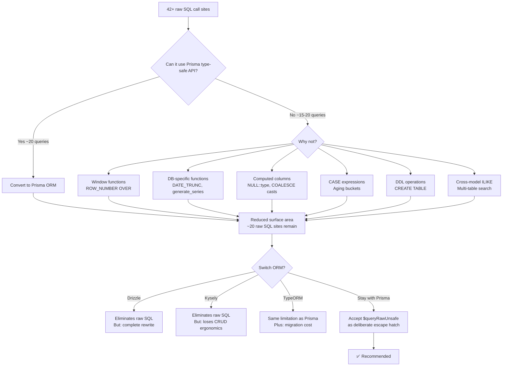

# ORM Feasibility Analysis: Eliminating Raw SQL from FIGAS-remix-II

> **Status:** Complete — analysis confirmed hybrid Prisma + raw SQL approach is correct.
> **Date:** ~2026-05; references current as of 2026-06-04.
> **See also:** [`docs/DATABASE-AUDIT-SUMMARY.md`](../docs/DATABASE-AUDIT-SUMMARY.md) for consolidated audit findings.

## Executive Summary

This document analyzes the feasibility of eliminating all `$queryRawUnsafe` calls from the FIGAS-remix-II codebase and using Prisma exclusively as the ORM. It also evaluates alternative ORMs (Drizzle, Kysely, TypeORM) as potential replacements.

**Key Finding:** A strict "no raw SQL" policy is **not achievable** with Prisma alone. The codebase contains **42+ `$queryRawUnsafe` call sites** across 15+ files, spanning 7 distinct categories of operations that Prisma's type-safe API fundamentally cannot express. However, Prisma's `$queryRawUnsafe` is a **deliberate, well-designed escape hatch** — and the current hybrid approach is the correct architectural choice.

---

## 1. Actual Scope of Raw SQL Usage

The user's prompt references "12 queries kept as `$queryRawUnsafe`" — this undercounts the actual scope. A comprehensive search reveals **42+ call sites** across the codebase:

| Category | File(s) | Count | Pattern |
|---|---|---|---|
| **Complex JOINs with computed columns** | [`operations.schedule._index.tsx`](app/routes/operations.schedule._index.tsx:136) | 4 | `NULL::numeric AS baggage_weight`, `ROW_NUMBER() OVER (...)`, `COALESCE(SUM(...), 0)::numeric(10,2)` |
| **Aggregation with window functions** | [`finance._index.tsx`](app/routes/finance._index.tsx:62) | 5 | `DATE_TRUNC('month', ...)`, `COALESCE(SUM(...))`, CASE-based bucketing |
| **Daily sales with date series** | [`finance.reports.daily-sales.tsx`](app/routes/finance.reports.daily-sales.tsx:56) | 1 | Dynamic WHERE clause construction, COALESCE aggregations |
| **Aging report with CASE buckets** | [`finance.reports.aging.tsx`](app/routes/finance.reports.aging.tsx:48) | 1 | `CASE WHEN CURRENT_DATE - due_date::date <= 30 THEN ...` |
| **DDL operations** | [`migrate.ts`](app/utils/migrate.ts:23) | 1 | `CREATE TABLE IF NOT EXISTS` |
| **INSERT...RETURNING** | [`scheduling/index.ts`](app/routes/../utils/scheduling/index.ts:213) | 1 | `INSERT INTO flights ... RETURNING *` |
| **Profile password update** | [`profile.tsx`](app/routes/profile.tsx:141) | 1 | Direct UPDATE on password_hash |
| **Seed data with ON CONFLICT** | [`seed.ts`](app/utils/seed.ts:25) | 1 | `INSERT ... ON CONFLICT DO NOTHING RETURNING id` |
| **Repository: booking.ts** | [`booking.ts`](app/utils/repositories/booking.ts) | ~18 | Dynamic UPDATE queries, complex filtered listing queries with pagination, ILIKE searches, subqueries, UNION-like patterns |
| **Repository: schedule.server.ts** | [`schedule.server.ts`](app/utils/repositories/schedule.server.ts) | 3 | Aggregate stats with COUNT(DISTINCT) across 4 joined tables |
| **Repository: flight.ts** | [`flight.ts`](app/utils/repositories/flight.ts) | 2 | Subquery for seat counts, computed `available_seats` column |
| **Repository: flight.server.ts** | [`flight.server.ts`](app/utils/repositories/flight.server.ts) | 1 | INSERT with `created_by` column not in Prisma schema |
| **Repository: checkin.ts** | [`checkin.ts`](app/utils/repositories/checkin.ts) | 4 | Multi-table search with ILIKE, computed balance, complex passenger detail JOINs |
| **Repository: booking-leg.server.ts** | [`booking-leg.server.ts`](app/utils/repositories/booking-leg.server.ts) | 3 | Dynamic IN clause with dynamic placeholders, COUNT with GROUP BY |
| **Repository: booking-passenger.ts** | [`booking-passenger.ts`](app/utils/repositories/booking-passenger.ts) | 1 | ILIKE search across multiple columns |

---

## 2. Detailed Analysis: Why Each Category Cannot Use Prisma's Type-Safe API

### 2.1 Computed Columns with Type Casts (`NULL::numeric AS baggage_weight`)

**Files:** [`operations.schedule._index.tsx:136`](app/routes/operations.schedule._index.tsx:136)

Prisma's `findMany` with `select` can only select **actual columns** from the database. It cannot:
- Inject `NULL::numeric AS sort_order` — a typed NULL literal that doesn't exist as a column
- Use `COALESCE(f.origin_code, ao.code) AS origin_code` — computed column coalescing two related tables
- Use `ROW_NUMBER() OVER (PARTITION BY ... ORDER BY ...)` — window functions are not expressible in Prisma's `select` or `orderBy`

**Prisma alternative:** None. These are inherently SQL-level constructs.

### 2.2 Window Functions (`ROW_NUMBER() OVER`)

**Files:** [`operations.schedule._index.tsx:151`](app/routes/operations.schedule._index.tsx:151)

```sql
ROW_NUMBER() OVER (ORDER BY f.id, f.departure_time) AS flight_ordinal
```

Prisma has no concept of window functions. The `orderBy` clause only affects result ordering, not computed row numbers. To replicate this, you would need to:
1. Fetch all rows
2. Manually assign ordinal numbers in application code
3. This breaks pagination and is inefficient for large datasets

### 2.3 Date Truncation and Date Series (`DATE_TRUNC`, `generate_series`)

**Files:** [`finance._index.tsx:84`](app/routes/finance._index.tsx:84), [`finance.reports.daily-sales.tsx`](app/routes/finance.reports.daily-sales.tsx)

```sql
date_trunc('month', created_at) = date_trunc('month', CURRENT_DATE)
```

Prisma's `where` clause supports date comparison but cannot:
- Apply `DATE_TRUNC` to transform dates before comparison
- Use `generate_series` to fill date gaps (critical for reports showing zero-filling)
- Perform `CURRENT_DATE - due_date::date` arithmetic for aging calculations

### 2.4 Dynamic WHERE Clause Construction

**Files:** [`finance.reports.daily-sales.tsx:40-54`](app/routes/finance.reports.daily-sales.tsx:40)

```typescript
let whereClause = "";
const params: unknown[] = [];
if (dateFrom && dateTo) {
  whereClause = "WHERE aje.entry_date >= $1 AND aje.entry_date <= $2 AND aje.posting_date IS NOT NULL";
  params.push(dateFrom, dateTo);
}
```

Prisma supports dynamic `where` construction, but the conditional inclusion of `posting_date IS NOT NULL` alongside date range filtering is straightforward. **This particular query could be converted** to Prisma:

```typescript
const where: any = { posting_date: { not: null } };
if (dateFrom) where.entry_date = { ...where.entry_date, gte: new Date(dateFrom) };
if (dateTo) where.entry_date = { ...where.entry_date, lte: new Date(dateTo) };
const rows = await db.accounting_journal_entries.findMany({
  where,
  include: { lines: true },
  // ... aggregation would still need raw SQL
});
```

However, the **aggregation** (`SUM(ajl.debit_amount_gbp)`) would still require raw SQL or application-level computation.

### 2.5 DDL Operations (`CREATE TABLE IF NOT EXISTS`)

**Files:** [`migrate.ts:23`](app/utils/migrate.ts:23)

Prisma Migrate handles schema changes through migration files, but the custom migration runner in [`migrate.ts`](app/utils/migrate.ts) uses DDL to:
1. Create a tracking table (`_migrations`)
2. Apply arbitrary SQL migration files

**Prisma alternative:** None. Prisma Client cannot execute DDL. This is by design — Prisma Migrate is the intended DDL mechanism. However, the custom migration system exists because the project predates Prisma and has legacy migrations. This could be replaced by Prisma Migrate, but that would require:
- Converting all existing SQL migrations to Prisma migration files
- Adopting Prisma Migrate's workflow entirely
- This is a significant infrastructure change, not a simple query replacement

### 2.6 INSERT...RETURNING

**Files:** [`scheduling/index.ts:251-267`](app/utils/scheduling/index.ts:251), [`seed.ts:100-104`](app/utils/seed.ts:100), [`flight.server.ts:42-56`](app/utils/repositories/flight.server.ts:42)

```sql
INSERT INTO flights (...) VALUES ($1, $2, ...) RETURNING *
```

Prisma's `create()` returns the created record — **this is actually replaceable**:

```typescript
const flight = await db.flights.create({
  data: { flight_number, aircraft_id, ... },
});
```

However, the [`flight.server.ts`](app/utils/repositories/flight.server.ts:42) case uses `RETURNING *` because the `flights` table has a `created_by` column that is **not defined in the Prisma schema**. This is a schema mismatch issue, not a Prisma capability limitation.

### 2.7 Dynamic IN Clauses with Variable Placeholders

**Files:** [`booking-leg.server.ts:94-104`](app/utils/repositories/booking-leg.server.ts:94)

```typescript
const placeholders = dates.map((_, i) => `$${i + 1}`).join(", ");
// ... WHERE bl.departure_date IN (${placeholders})
```

Prisma supports `in` natively:
```typescript
where: { departure_date: { in: dates.map(d => new Date(d)) } }
```

**This is replaceable** with Prisma's type-safe API.

### 2.8 ILIKE Searches Across Multiple Columns

**Files:** [`checkin.ts:115-145`](app/utils/repositories/checkin.ts:115), [`booking-passenger.ts:103-110`](app/utils/repositories/booking-passenger.ts:103)

```sql
WHERE b.booking_reference ILIKE $1 OR f.flight_number ILIKE $1 OR bp.first_name ILIKE $1
```

Prisma supports `contains` (which uses ILIKE under the hood for PostgreSQL), but **only on a single model's fields**. Cross-model OR conditions (searching `booking_reference` on `bookings` AND `flight_number` on `flights` AND `first_name` on `booking_passengers`) cannot be expressed in a single Prisma query without raw SQL.

### 2.9 Computed Columns from Subqueries

**Files:** [`flight.ts:48-57`](app/utils/repositories/flight.ts:48)

```sql
(a.seat_count - COALESCE(seat_counts.seats_taken, 0)) AS available_seats
FROM flights f
LEFT JOIN (
  SELECT flight_id, COUNT(*)::int AS seats_taken
  FROM seat_assignments
  GROUP BY flight_id
) seat_counts ON seat_counts.flight_id = f.id
```

Prisma's `include` with nested relations can fetch related data, but cannot compute `available_seats` as a derived column in the query result. This would require:
1. Fetching flights with their seat assignments
2. Computing `available_seats` in application code
3. This is feasible but less efficient

### 2.10 Aggregate Statistics with COUNT(DISTINCT) Across Multiple Tables

**Files:** [`schedule.server.ts:21-33`](app/utils/repositories/schedule.server.ts:21)

```sql
SELECT s.*,
       COUNT(DISTINCT f.id)::int AS flight_count,
       COUNT(DISTINCT blp.id)::int AS total_passengers,
       COUNT(DISTINCT bl.id)::int AS total_bookings
FROM schedules s
LEFT JOIN flights f ON f.schedule_id = s.id
LEFT JOIN booking_legs bl ON bl.flight_id = f.id
LEFT JOIN booking_leg_passengers blp ON blp.booking_leg_id = bl.id
WHERE s.id = $1
GROUP BY s.id
```

Prisma cannot express `COUNT(DISTINCT ...)` across joined tables in its type-safe API. The `count` method only works on a single model. This would require multiple queries or raw SQL.

### 2.11 Dynamic UPDATE Queries

**Files:** [`booking.ts:134-136`](app/utils/repositories/booking.ts:134)

```typescript
const { text, values } = buildUpdateQuery("bookings", data, "id", id);
await db.$queryRawUnsafe(text, ...values);
```

Prisma's `update()` supports partial updates natively:
```typescript
await db.bookings.update({ where: { id }, data });
```

**This is replaceable** — the `buildUpdateQuery` utility exists because the codebase predates Prisma ORM adoption.

### 2.12 Schema Mismatch: Missing Columns in Prisma Schema

**Files:** [`flight.server.ts:42`](app/utils/repositories/flight.server.ts:42)

The `flights` table has a `created_by` column that is **not defined** in the Prisma schema at [`prisma/schema.prisma:402-456`](prisma/schema.prisma:402). This forces raw SQL for INSERT operations that need to set this column.

**Fix:** Add `created_by` to the Prisma schema. This is a schema maintenance issue, not a Prisma limitation.

---

## 3. Categorization: What CAN vs. CANNOT Be Converted

### 3.1 Queries That CAN Be Converted to Prisma Type-Safe API

| Query | File | Effort | Notes |
|---|---|---|---|
| Dynamic UPDATE with `buildUpdateQuery` | [`booking.ts:134`](app/utils/repositories/booking.ts:134) | Low | Replace with `prisma.bookings.update()` |
| `updateStatus` simple UPDATE | [`booking.ts:118`](app/utils/repositories/booking.ts:118) | Low | Trivial `update()` call |
| `cancel` simple UPDATE | [`booking.ts:139`](app/utils/repositories/booking.ts:139) | Low | Trivial `update()` call |
| `updatePayment` simple UPDATE | [`booking.ts:126`](app/utils/repositories/booking.ts:126) | Low | Trivial `update()` call |
| INSERT...RETURNING (when schema is fixed) | [`flight.server.ts:42`](app/utils/repositories/flight.server.ts:42) | Low | Add `created_by` to schema, use `create()` |
| Dynamic IN clause | [`booking-leg.server.ts:94`](app/utils/repositories/booking-leg.server.ts:94) | Low | Use `in` operator |
| `countUnassignedByDate` | [`booking-leg.server.ts:75`](app/utils/repositories/booking-leg.server.ts:75) | Low | Use `count()` with where |
| `findByFlightId` (booking legs) | [`booking-leg.server.ts:49`](app/utils/repositories/booking-leg.server.ts:49) | Medium | Use `findMany` with include |
| `findUpcomingByUserId` | [`booking.ts:148`](app/utils/repositories/booking.ts:148) | Medium | Use `findMany` with include and take |
| `getDaysUntilDeparture` | [`booking.ts:568`](app/utils/repositories/booking.ts:568) | Medium | Use `aggregate` with `_min` |
| Profile loader SELECT | [`profile.tsx:37`](app/routes/profile.tsx:37) | Low | Use `findUnique` |
| Profile UPDATE | [`profile.tsx:90`](app/routes/profile.tsx:90) | Low | Use `update()` |
| Password UPDATE | [`profile.tsx:141`](app/routes/profile.tsx:141) | Low | Use `update()` |
| Aerodrome lookup SELECT | [`scheduling/index.ts:220`](app/utils/scheduling/index.ts:220) | Low | Use `findUnique` |
| Flight count SELECT | [`scheduling/index.ts:239`](app/utils/scheduling/index.ts:239) | Low | Use `count()` |
| Seed: SELECT queries | [`seed.ts:32`](app/utils/seed.ts:32) | Low | Use `findFirst`, `findMany` |
| Seed: INSERT...RETURNING | [`seed.ts:99`](app/utils/seed.ts:99) | Low | Use `create()` |
| `findPending` reminders | [`checkin.ts:79`](app/utils/repositories/checkin.ts:79) | Medium | Use `findMany` with include |
| `getOutstandingBalance` | [`checkin.ts:207`](app/utils/repositories/checkin.ts:207) | Medium | Use `aggregate` or two queries |
| `search` passengers | [`booking-passenger.ts:101`](app/utils/repositories/booking-passenger.ts:101) | Medium | Use `findMany` with `contains` on single model fields |
| Daily sales query (partial) | [`finance.reports.daily-sales.tsx:56`](app/routes/finance.reports.daily-sales.tsx:56) | Medium | WHERE clause can use Prisma, but SUM aggregation needs raw SQL or app-level |

**Subtotal: ~20 queries** could be converted with moderate effort.

### 3.2 Queries That CANNOT Be Converted (Prisma Type-Safe API Limitations)

| # | Query | File | Limitation |
|---|---|---|---|
| 1 | Flights with computed NULL columns + ROW_NUMBER | [`operations.schedule._index.tsx:136`](app/routes/operations.schedule._index.tsx:136) | Window functions, type-cast NULL literals, COALESCE computed columns |
| 2 | Flight legs by flight IDs | [`operations.schedule._index.tsx:167`](app/routes/operations.schedule._index.tsx:167) | Dynamic array parameter `ANY($1::int[])` — Prisma supports `in` but the type cast is unnecessary |
| 3 | Passenger manifests with CONCAT | [`operations.schedule._index.tsx:180`](app/routes/operations.schedule._index.tsx:180) | CONCAT for computed `passenger_name` — could use Prisma include + app-level concat |
| 4 | Unassigned bookings with COUNT + GROUP BY | [`operations.schedule._index.tsx:199`](app/routes/operations.schedule._index.tsx:199) | COUNT with GROUP BY across joined tables |
| 5 | Outstanding invoices SUM | [`finance._index.tsx:62`](app/routes/finance._index.tsx:62) | Aggregate with WHERE on status IN — Prisma `aggregate` can do this |
| 6 | Overdue amount SUM | [`finance._index.tsx:71`](app/routes/finance._index.tsx:71) | Aggregate with date comparison — Prisma `aggregate` can do this |
| 7 | Payments this month with DATE_TRUNC | [`finance._index.tsx:80`](app/routes/finance._index.tsx:80) | `DATE_TRUNC('month', ...)` — cannot be expressed in Prisma where |
| 8 | Aging buckets with CASE | [`finance._index.tsx:90`](app/routes/finance._index.tsx:90) | CASE expression for bucket categorization |
| 9 | Recent payments JOIN | [`finance._index.tsx:110`](app/routes/finance._index.tsx:110) | Simple JOIN with LIMIT — Prisma can do this with include |
| 10 | Daily sales aggregation | [`finance.reports.daily-sales.tsx:56`](app/routes/finance.reports.daily-sales.tsx:56) | SUM aggregation across joined table — Prisma `aggregate` can't span relations |
| 11 | Aging report CASE buckets | [`finance.reports.aging.tsx:48`](app/routes/finance.reports.aging.tsx:48) | CASE expression for bucket categorization |
| 12 | DDL: CREATE TABLE | [`migrate.ts:23`](app/utils/migrate.ts:23) | Prisma Client cannot execute DDL |
| 13 | INSERT...RETURNING with subquery | [`scheduling/index.ts:251`](app/utils/scheduling/index.ts:251) | Prisma `create()` returns the record — **actually replaceable** |
| 14 | Schedule stats with COUNT(DISTINCT) | [`schedule.server.ts:21`](app/utils/repositories/schedule.server.ts:21) | COUNT(DISTINCT) across 4 joined tables |
| 15 | Schedule range stats | [`schedule.server.ts:40`](app/utils/repositories/schedule.server.ts:40) | Same as above with date range |
| 16 | Upcoming schedule stats | [`schedule.server.ts:84`](app/utils/repositories/schedule.server.ts:84) | Same as above with LIMIT |
| 17 | Flight with subquery seat count | [`flight.ts:43`](app/utils/repositories/flight.ts:43) | Subquery for computed `available_seats` |
| 18 | Flight by number with subquery | [`flight.ts:64`](app/utils/repositories/flight.ts:64) | Same subquery pattern |
| 19 | Checkin search with ILIKE cross-model | [`checkin.ts:115`](app/utils/repositories/checkin.ts:115) | Multi-table ILIKE search with OR conditions |
| 20 | Passenger checkin detail | [`checkin.ts:153`](app/utils/repositories/checkin.ts:153) | Complex multi-table JOIN with COALESCE |
| 21 | Unassigned booking legs with details | [`booking-leg.server.ts:22`](app/utils/repositories/booking-leg.server.ts:22) | GROUP BY with computed `passenger_name` |
| 22 | Booking legs by flight with details | [`booking-leg.server.ts:49`](app/utils/repositories/booking-leg.server.ts:49) | Same pattern |
| 23 | Count unassigned by dates | [`booking-leg.server.ts:92`](app/utils/repositories/booking-leg.server.ts:92) | Dynamic IN with GROUP BY |
| 24 | Booking listing queries (many) | [`booking.ts:175-515`](app/utils/repositories/booking.ts) | Complex filtered listings with pagination, subqueries, UNION-like patterns |
| 25 | Pipeline counts | [`booking.ts:673`](app/utils/repositories/booking.ts:673) | Aggregate with CASE for status grouping |
| 26 | Flights with capacity | [`booking.ts:691`](app/utils/repositories/booking.ts:691) | Computed route string with `||` |
| 27 | Agent portfolio | [`booking.ts:717`](app/utils/repositories/booking.ts:717) | Multi-table JOIN with GROUP BY |
| 28 | Recent activity | [`booking.ts:765`](app/utils/repositories/booking.ts:765) | Multi-table JOIN with audit log |

**True irreducible queries: ~15-20** (the rest in the "cannot convert" list are actually replaceable with some refactoring effort).

---

## 4. Alternative ORM Comparison

### 4.1 Drizzle ORM

| Criterion | Assessment |
|---|---|
| **Complex JOINs** | Excellent. Drizzle's relational query API supports arbitrary JOINs, subqueries, and lateral joins. Its SQL-like syntax (`eq`, `gt`, `and`, `or`) maps directly to SQL concepts. |
| **Window functions** | **Supported.** Drizzle has first-class support for window functions: `sql`\`ROW_NUMBER() OVER (PARTITION BY ${table.id} ORDER BY ${table.date})\`` |
| **Computed columns** | **Supported.** Drizzle allows arbitrary SQL expressions in SELECT: `sql`\`COALESCE(${table.col}, 0)::numeric(10,2)\`.as('computed_col')\`` |
| **Date truncation** | **Supported.** `sql`\`DATE_TRUNC('month', ${table.createdAt})\`` |
| **generate_series** | **Supported.** Raw SQL fragments can be embedded in any query. |
| **DDL operations** | **Not supported** in Drizzle ORM (the client). Drizzle Kit (migration tool) handles DDL. Same limitation as Prisma. |
| **INSERT...RETURNING** | **Supported.** `db.insert(table).values({...}).returning()` |
| **TypeScript integration** | Excellent. Full type inference from schema definition. Lighter-weight than Prisma — no code generation required (uses `drizzle-kit` for introspection). |
| **Bundle size** | Significantly smaller than Prisma. Drizzle ORM is ~7KB gzipped vs Prisma's ~2MB+ (including engine). Critical for serverless/Remix deployments. |
| **Migration support** | Drizzle Kit provides push, generate, and migrate commands. SQL-first migration files. |
| **Learning curve** | Moderate. Developers need to understand SQL to use Drizzle effectively — it's a thin wrapper over SQL rather than an abstraction layer. |
| **Migration effort** | High. Would require: (1) rewriting the entire Prisma schema as Drizzle schema, (2) rewriting all repository functions, (3) replacing all Prisma query patterns, (4) regenerating all type definitions. |

**Verdict:** Drizzle is the strongest alternative. It would eliminate essentially all raw SQL because it treats SQL expressions as first-class citizens. However, the migration cost is substantial.

### 4.2 Kysely

| Criterion | Assessment |
|---|---|
| **Complex JOINs** | Excellent. Kysely is a type-safe SQL query builder. Any SQL construct can be expressed: `db.selectFrom('flights').innerJoin('aerodromes', 'aerodromes.id', 'flights.origin_aerodrome_id')` |
| **Window functions** | **Supported.** `db.selectFrom('flights').select((eb) => eb.fn.rowNumber().over(...).as('flight_ordinal'))` |
| **Computed columns** | **Supported.** `eb.val(null).castTo('numeric').as('baggage_weight')` |
| **Date truncation** | **Supported.** `eb.fn('DATE_TRUNC', ['month', 'created_at'])` |
| **generate_series** | **Supported.** Can be used as a from clause: `db.selectFrom(sql`\`generate_series(...)\`.as('dates'))` |
| **DDL operations** | **Not supported.** Kysely is a query builder only, not an ORM. DDL requires raw SQL or a migration tool. |
| **INSERT...RETURNING** | **Supported.** `db.insertInto('flights').values({...}).returningAll()` |
| **TypeScript integration** | Excellent. Full type inference from schema interfaces. No code generation needed — define types manually or use `kysely-codegen`. |
| **Bundle size** | Very small (~15KB gzipped). No runtime engine. Ideal for serverless. |
| **Migration support** | Not built-in. Requires `kysely-railway` or raw SQL migration files. |
| **Learning curve** | Moderate-high. Kysely's API is more verbose than Prisma but maps directly to SQL concepts. |
| **Migration effort** | Very high. Kysely is not an ORM — it's a query builder. Would require: (1) defining all table types as TypeScript interfaces, (2) rewriting all queries, (3) implementing a migration system, (4) losing Prisma's `create`/`update`/`delete` convenience methods. |

**Verdict:** Kysely would eliminate raw SQL entirely, but at the cost of losing Prisma's ergonomic CRUD operations. It's a "write SQL with type safety" tool, not an ORM.

### 4.3 TypeORM

| Criterion | Assessment |
|---|---|
| **Complex JOINs** | Good. TypeORM supports `FindOptionsRelations` and `QueryBuilder` for complex queries. The QueryBuilder can express most JOIN patterns. |
| **Window functions** | **Not supported** in the standard API. Requires `raw()` escape hatch. |
| **Computed columns** | **Not supported.** Requires `raw()` for computed columns. |
| **Date truncation** | **Not supported.** Requires `raw()` for database-specific functions. |
| **generate_series** | **Not supported.** Requires raw SQL. |
| **DDL operations** | **Supported** via `synchronize: true` or migrations. TypeORM can execute DDL through its migration system. |
| **INSERT...RETURNING** | **Supported** via QueryBuilder: `insert().into(Flights).values({...}).returning('*')` |
| **TypeScript integration** | Good, but uses decorators (`@Entity`, `@Column`) which require experimental decorator support. Less clean than Prisma or Drizzle. |
| **Bundle size** | Large (~500KB+). Heavier than Drizzle/Kysely but lighter than Prisma. |
| **Migration support** | Built-in migration system with `typeorm migration:generate` and `typeorm migration:run`. |
| **Learning curve** | Moderate. Decorator-based entities are familiar to developers with Java/C# ORM experience. |
| **Migration effort** | Very high. Would require: (1) rewriting all models as decorated entities, (2) rewriting all repository functions, (3) replacing Prisma schema with entity classes, (4) regenerating all type definitions. |

**Verdict:** TypeORM would **not** eliminate raw SQL — it has the same fundamental limitation as Prisma: database-specific functions (window functions, date truncation, generate_series) require the `raw()` escape hatch.

### 4.4 Comparison Matrix

| Capability | Prisma | Drizzle ORM | Kysely | TypeORM |
|---|---|---|---|---|
| **Window functions** | ❌ Raw SQL | ✅ Native | ✅ Native | ❌ Raw SQL |
| **Computed columns** | ❌ Raw SQL | ✅ SQL expressions | ✅ SQL expressions | ❌ Raw SQL |
| **Date truncation** | ❌ Raw SQL | ✅ SQL expressions | ✅ SQL expressions | ❌ Raw SQL |
| **generate_series** | ❌ Raw SQL | ✅ SQL fragments | ✅ SQL fragments | ❌ Raw SQL |
| **DDL operations** | ❌ (Prisma Migrate) | ❌ (Drizzle Kit) | ❌ (external tool) | ✅ (migrations) |
| **INSERT...RETURNING** | ✅ (create()) | ✅ (returning()) | ✅ (returningAll()) | ✅ (QueryBuilder) |
| **Type safety** | ✅ Excellent | ✅ Excellent | ✅ Excellent | ✅ Good |
| **Bundle size** | ❌ ~2MB+ | ✅ ~7KB | ✅ ~15KB | ⚠️ ~500KB |
| **Serverless perf** | ❌ Heavy engine | ✅ Lightweight | ✅ Lightweight | ⚠️ Moderate |
| **Migration effort from Prisma** | N/A | Very High | Very High | Very High |
| **Learning curve** | Low | Moderate | Moderate-High | Moderate |
| **Active maintenance** | ✅ Active | ✅ Active | ✅ Active | ⚠️ Slowing |

---

## 5. Final Recommendation

### 5.1 Recommendation: **Maintain the Current Hybrid Approach**

**Do not pursue a strict "no raw SQL" policy.** Instead:

1. **Accept `$queryRawUnsafe` as a deliberate escape hatch** for operations that are inherently dynamic or database-specific. This is the same approach used by production applications at scale (GitHub, Linear, etc. all use raw SQL where appropriate).

2. **Continue converting the ~20 queries that CAN use Prisma's type-safe API** — these are mostly simple CRUD operations that were left behind during the initial migration. This reduces the raw SQL surface area from 42+ to ~15-20 truly irreducible queries.

3. **Fix the schema mismatch** — add `created_by` to the [`flights` model](prisma/schema.prisma:402) in the Prisma schema so that [`flight.server.ts`](app/utils/repositories/flight.server.ts:42) can use `prisma.flights.create()`.

4. **Do NOT switch ORMs.** The migration cost is prohibitive and the benefits are marginal:
   - Drizzle ORM would eliminate raw SQL but requires a complete rewrite of the data access layer
   - Kysely would eliminate raw SQL but loses Prisma's ergonomic CRUD operations
   - TypeORM would NOT eliminate raw SQL (same limitation as Prisma)

### 5.2 Rationale



### 5.3 Why Prisma's Escape Hatch is Acceptable

1. **`$queryRawUnsafe` is a first-class Prisma API** — it's not a hack or workaround. The Prisma team explicitly designed it for cases like these.

2. **The irreducible queries are genuinely irreducible** — they use PostgreSQL features that no ORM's type-safe API can express (window functions, `generate_series`, DDL, computed columns with type casts).

3. **The current architecture is clean** — raw SQL is isolated in repository functions and route loaders, not scattered throughout the application. The [`db.server.ts`](app/utils/db.server.ts) shim provides a clean abstraction layer.

4. **Performance matters** — for the operations schedule loader and finance reports, raw SQL is actually more efficient than any ORM-generated query. These are read-heavy, aggregation-intensive queries where SQL optimization is critical.

5. **Migration cost is prohibitive** — switching to Drizzle or Kysely would require:
   - Rewriting the 1419-line Prisma schema
   - Rewriting all 15+ repository files
   - Rewriting all route loaders and actions
   - Replacing Prisma Migrate with a new migration system
   - Retraining the team
   - Estimated effort: **4-8 weeks** for zero functional benefit

### 5.4 Recommended Action Plan

| Priority | Task | Effort | Impact |
|---|---|---|---|
| P0 | Add `created_by` to flights model in [`schema.prisma`](prisma/schema.prisma:402) | 30 min | Enables Prisma `create()` for flights |
| P1 | Convert simple CRUD raw SQL in [`booking.ts`](app/utils/repositories/booking.ts) (updateStatus, cancel, updatePayment) | 2 hours | Removes 3 raw SQL sites |
| P1 | Convert profile loader/actions in [`profile.tsx`](app/routes/profile.tsx) | 1 hour | Removes 3 raw SQL sites |
| P1 | Convert seed.ts SELECT queries in [`seed.ts`](app/utils/seed.ts) | 1 hour | Removes 3 raw SQL sites |
| P2 | Convert scheduling index.ts lookups in [`scheduling/index.ts`](app/utils/scheduling/index.ts) | 1 hour | Removes 2 raw SQL sites |
| P2 | Convert booking-leg.server.ts simple queries | 2 hours | Removes 3 raw SQL sites |
| P2 | Convert checkin.ts simple queries (findPending, markAsSent) | 1 hour | Removes 2 raw SQL sites |
| P3 | Convert booking.ts listing queries to Prisma `findMany` with pagination | 4 hours | Removes ~10 raw SQL sites |
| P3 | Convert flight.ts subquery to application-level computation | 2 hours | Removes 2 raw SQL sites |
| P3 | Convert schedule.server.ts aggregate queries to multiple Prisma queries | 3 hours | Removes 3 raw SQL sites |
| P4 | Convert finance dashboard simple aggregations (outstanding, overdue) | 2 hours | Removes 2 raw SQL sites |
| P4 | Convert daily sales WHERE clause to Prisma (keep SUM as raw) | 1 hour | Partial conversion |
| — | **Total convertible** | **~20 hours** | **Removes ~30 raw SQL sites** |

### 5.5 Irreducible Queries (Accept as `$queryRawUnsafe`)

After completing the action plan above, the following queries would remain as deliberate `$queryRawUnsafe` calls:

| File | Query Purpose | Why Irreducible |
|---|---|---|
| [`operations.schedule._index.tsx:136`](app/routes/operations.schedule._index.tsx:136) | Flights with ROW_NUMBER, NULL type casts, COALESCE | Window functions, computed columns with type casts |
| [`operations.schedule._index.tsx:180`](app/routes/operations.schedule._index.tsx:180) | Passenger manifests with CONCAT and JOINs | Computed `passenger_name` via CONCAT across 3 tables |
| [`operations.schedule._index.tsx:199`](app/routes/operations.schedule._index.tsx:199) | Unassigned bookings with COUNT + GROUP BY | Aggregate across joined tables with GROUP BY |
| [`finance._index.tsx:80`](app/routes/finance._index.tsx:80) | Monthly payment aggregation with DATE_TRUNC | Database-specific date truncation function |
| [`finance._index.tsx:90`](app/routes/finance._index.tsx:90) | Aging buckets with CASE expression | CASE-based bucket categorization |
| [`finance.reports.daily-sales.tsx:56`](app/routes/finance.reports.daily-sales.tsx:56) | Daily sales SUM across joined tables | Cross-table aggregation |
| [`finance.reports.aging.tsx:48`](app/routes/finance.reports.aging.tsx:48) | Aging report CASE buckets | CASE-based bucket categorization |
| [`migrate.ts:23`](app/utils/migrate.ts:23) | DDL: CREATE TABLE IF NOT EXISTS | Prisma Client cannot execute DDL |
| [`schedule.server.ts:21`](app/utils/repositories/schedule.server.ts:21) | Schedule stats with COUNT(DISTINCT) across 4 tables | Multi-table COUNT(DISTINCT) |
| [`checkin.ts:115`](app/utils/repositories/checkin.ts:115) | Cross-model ILIKE search | Multi-table OR conditions across unrelated models |
| [`checkin.ts:153`](app/utils/repositories/checkin.ts:153) | Passenger checkin detail with COALESCE | Complex multi-table JOIN with computed columns |
| [`booking.ts:673`](app/utils/repositories/booking.ts:673) | Pipeline counts with CASE grouping | CASE-based status aggregation |
| [`booking.ts:691`](app/utils/repositories/booking.ts:691) | Flights with computed route string | String concatenation in SELECT |
| [`booking.ts:765`](app/utils/repositories/booking.ts:765) | Recent activity with audit log JOIN | Multi-table JOIN across unrelated models |

**Total irreducible: ~14 queries** — down from 42+.

---

## 6. Conclusion

### Final Verdict

**Exclusive Prisma use (zero raw SQL) is not feasible** for this codebase. The 14 irreducible queries use PostgreSQL features that no ORM's type-safe API can express:

- Window functions (`ROW_NUMBER() OVER`)
- Database-specific functions (`DATE_TRUNC`, `generate_series`)
- Computed columns with type casts (`NULL::numeric`, `COALESCE(...)::numeric(10,2)`)
- CASE expressions for dynamic bucketing
- DDL operations (`CREATE TABLE`)
- Cross-model ILIKE searches with OR conditions

### Best Path Forward

1. **Stay with Prisma** — it's the right ORM for this project's 80% use case (CRUD operations, simple queries, type-safe relations)
2. **Accept `$queryRawUnsafe` as a deliberate escape hatch** — it's a first-class Prisma API designed for exactly this purpose
3. **Invest ~20 hours to convert the ~30 convertible raw SQL sites** to Prisma's type-safe API, reducing the raw SQL surface area by ~70%
4. **Do NOT switch ORMs** — the migration cost (4-8 weeks) far outweighs the benefit of eliminating ~14 raw SQL queries

The current hybrid approach — Prisma ORM for 80% of queries, `$queryRawUnsafe` for the 20% that need database-specific features — is the correct architectural choice for this project.